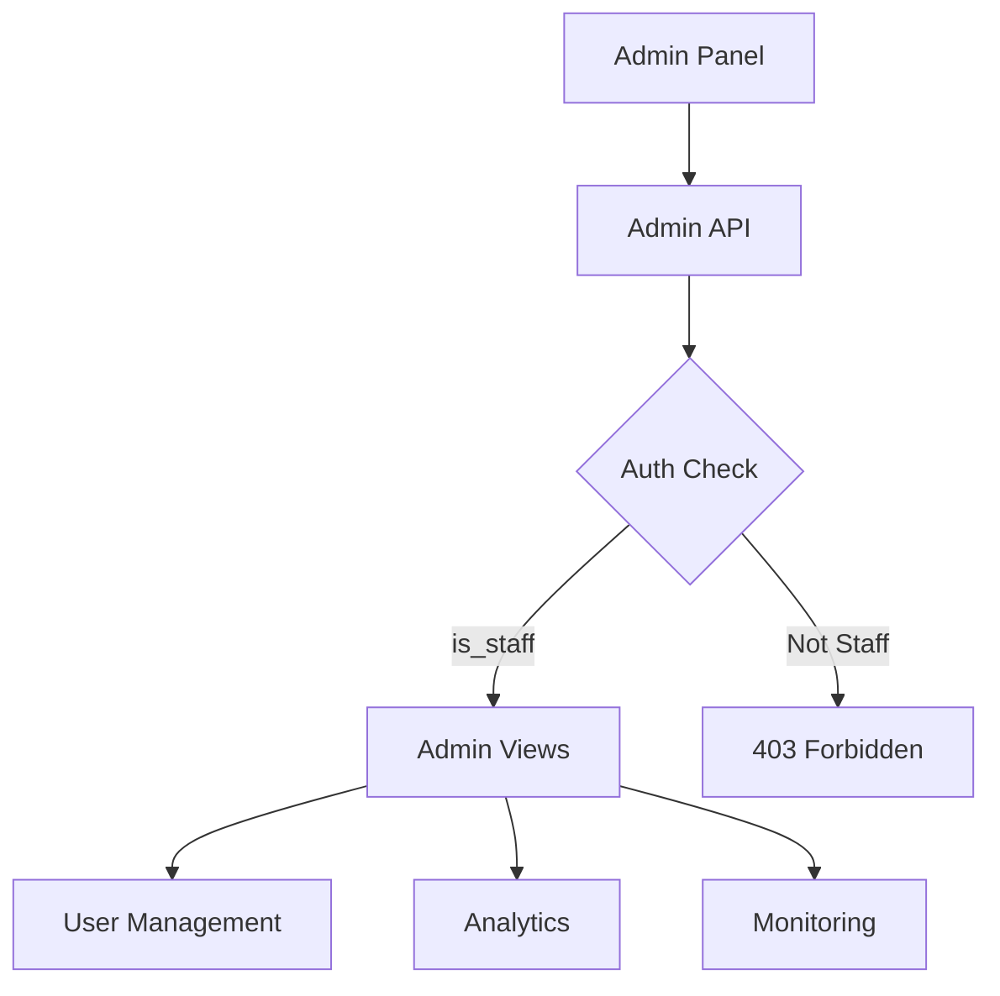

# Admin Module Context

## Purpose

Admin panel backend for system management:
- User management (list, edit, ban)
- Analytics and metrics
- System monitoring
- Content moderation

---

## Architecture

### Admin Flow

---

## Key Files

### Backend
- [admin_views.py](file:///e:/vocab_web/server/api/admin_views.py) - Admin endpoints
- [admin_models.py](file:///e:/vocab_web/server/api/admin_models.py) - Admin-specific models
- [admin_permissions.py](file:///e:/vocab_web/server/api/admin_permissions.py) - Permission classes
- [admin_urls.py](file:///e:/vocab_web/server/api/admin_urls.py) - URL routing
- [analytics_views.py](file:///e:/vocab_web/server/api/analytics_views.py)
- [analytics_service.py](file:///e:/vocab_web/server/api/analytics_service.py)

### Models
- Role-based access control
- ActivityLog for audit

---

## API Endpoints

| Endpoint | Method | Purpose |
|----------|--------|---------|
| `/api/admin/users/` | GET | List users |
| `/api/admin/users/{id}/` | GET/PUT | User details |
| `/api/admin/analytics/` | GET | Dashboard stats |
| `/api/admin/analytics/user-growth/` | GET | User growth chart |
| `/api/admin/system/health/` | GET | System status |

---

## Permissions

| Role | Capabilities |
|------|--------------|
| **Superuser** | Full access |
| **Staff** | User management, analytics |
| **Moderator** | Content moderation only |

---

## Analytics Metrics

- Total users, active users
- Content generated (stories, exams)
- AI provider usage
- Error rates
- User growth over time

---

*Version: 1.0 | Created: 2025-12-10*
