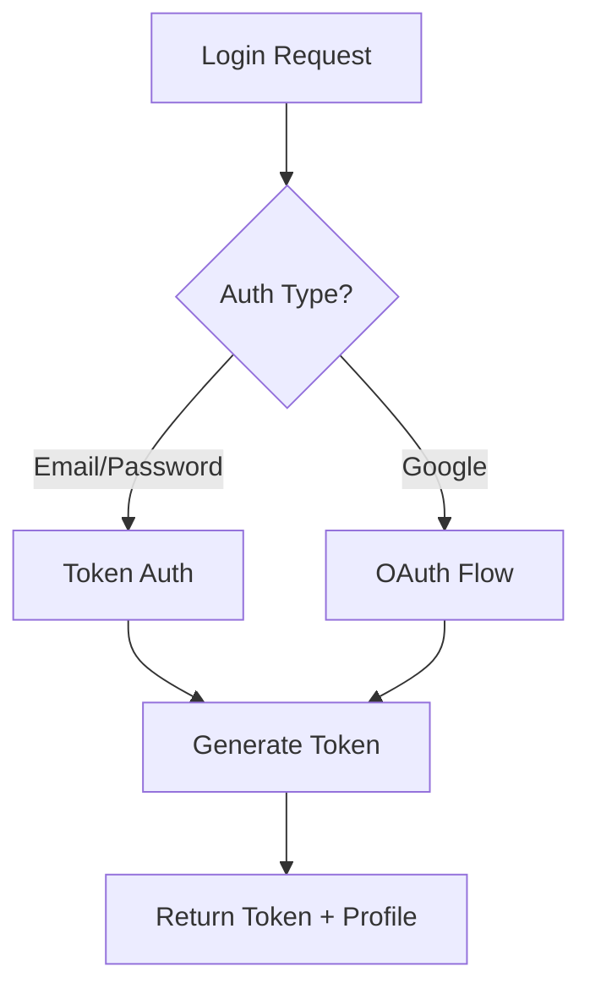

# Auth Module Context

## Purpose

Handles all authentication and user management:
- Token-based authentication
- Google OAuth 2.0 integration
- User profiles and preferences
- Social features (follow/unfollow)
- Password management

---

## Architecture

### Authentication Flow



### Data Models

- **User** (Django built-in): username, email, password
- **UserProfile**: preferences, language, API keys, avatar
- **UserRelationship**: follower/following connections

---

## Key Files

### Backend
- [authentication.py](file:///e:/vocab_web/server/api/authentication.py) - Token auth
- [google_auth.py](file:///e:/vocab_web/server/api/google_auth.py) - OAuth
- [password_views.py](file:///e:/vocab_web/server/api/password_views.py) - Password reset
- [email_utils.py](file:///e:/vocab_web/server/api/email_utils.py) - OTP emails

### Models
- [models.py](file:///e:/vocab_web/server/api/models.py) - UserProfile, UserRelationship

### Frontend
- [Login.jsx](file:///e:/vocab_web/client/src/pages/Login.jsx) - Desktop login
- [AuthContext](file:///e:/vocab_web/client/src/context/AuthContext.jsx) - Auth state

---

## Key Decisions

### Decision: Gmail API for OTP emails
- **Why**: Free, reliable, bypasses SMTP port blocking on Render
- **Consequences**: Requires OAuth credentials setup
- **Date**: 2025-12-02

### Decision: Profile stores API keys
- **Why**: User-provided keys enable AI features
- **Consequences**: Keys stored encrypted, per-user cost control
- **Date**: 2025-11-26

---

## API Endpoints

| Endpoint | Method | Purpose |
|----------|--------|---------|
| `/api/auth/login/` | POST | Email/password login |
| `/api/auth/register/` | POST | User registration |
| `/api/auth/google/` | POST | Google OAuth |
| `/api/auth/logout/` | POST | Invalidate token |
| `/api/auth/password-reset/` | POST | Request reset |
| `/api/profile/` | GET/PUT | User profile |
| `/api/profile/follow/` | POST | Follow user |

---

## Usage Example

```python
# Login
POST /api/auth/login/
{
    "email": "user@example.com",
    "password": "secure123"
}

# Response
{
    "token": "abc123...",
    "user": {
        "id": 1,
        "username": "user",
        "email": "user@example.com"
    }
}
```

---

## Common Tasks

### Add new OAuth provider
1. Create handler in `google_auth.py` pattern
2. Add callback endpoint
3. Update frontend social buttons

### Reset user password (admin)
1. Use Django admin or `reset_password.py` script
2. Generate new OTP via email

---

*Version: 1.0 | Created: 2025-12-10*
