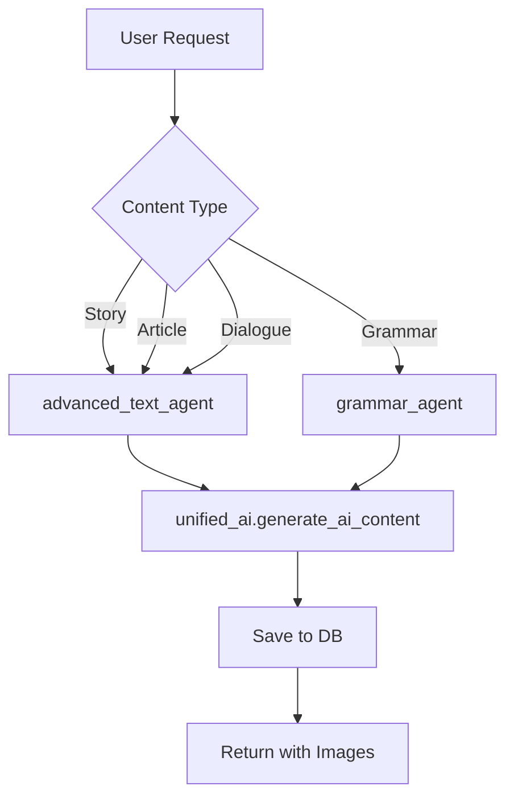

# Content Module Context

## Purpose

AI-powered content generation for language learning:
- Stories at CEFR levels (A1-C2)
- Educational articles
- Dialogue conversations
- Grammar lessons with Mermaid diagrams

---

## Architecture

### Content Generation Flow



### Content Types

| Type | Agent | Features |
|------|-------|----------|
| Story | advanced_text_agent | CEFR levels, topics, images |
| Article | advanced_text_agent | Educational, topics |
| Dialogue | advanced_text_agent | Conversational, roles |
| Grammar | grammar_agent | Rules, examples, diagrams |

---

## Key Files

### Agents (LangGraph)
- [advanced_text_agent.py](file:///e:/vocab_web/server/api/advanced_text_agent.py) - Main content agent
- [text_converter_agent.py](file:///e:/vocab_web/server/api/text_converter_agent.py) - Text conversion
- [grammar_agent.py](file:///e:/vocab_web/server/api/grammar_agent.py) - Grammar lessons

### Views
- [feature_views.py](file:///e:/vocab_web/server/api/feature_views.py) - Content endpoints
- [advanced_text_views.py](file:///e:/vocab_web/server/api/advanced_text_views.py)

### Frontend
- [TextGenerator.jsx](file:///e:/vocab_web/client/src/pages/TextGenerator.jsx)
- [StoryViewer.jsx](file:///e:/vocab_web/client/src/pages/StoryViewer.jsx)
- [ArticleViewer.jsx](file:///e:/vocab_web/client/src/pages/ArticleViewer.jsx)
- [DialogueViewer.jsx](file:///e:/vocab_web/client/src/pages/DialogueViewer.jsx)
- [GrammarPage.jsx](file:///e:/vocab_web/client/src/pages/GrammarPage.jsx)

### Mobile
- [MobileGenStory.jsx](file:///e:/vocab_web/client/src/pages/mobile/MobileGenStory.jsx)
- [MobileGenArticle.jsx](file:///e:/vocab_web/client/src/pages/mobile/MobileGenArticle.jsx)
- [MobileGenDialogue.jsx](file:///e:/vocab_web/client/src/pages/mobile/MobileGenDialogue.jsx)
- [MobileGrammar.jsx](file:///e:/vocab_web/client/src/pages/mobile/MobileGrammar.jsx)

---

## API Endpoints

| Endpoint | Method | Purpose |
|----------|--------|---------|
| `/api/generate-advanced-text/` | POST | Generate story/article/dialogue |
| `/api/generate-grammar/` | POST | Generate grammar lesson |
| `/api/saved-texts/` | GET | List saved content |
| `/api/saved-texts/{id}/` | GET | Get content detail |

---

## Request Example

```json
POST /api/generate-advanced-text/
{
    "content_type": "story",
    "topic": "A day at the beach",
    "level": "B1",
    "language": "de",
    "word_count": 500,
    "include_images": true
}
```

---

## Key Decisions

### Decision: LangGraph for content agents
- **Why**: Better control over multi-step generation
- **Consequences**: More complex, but reliable
- **Date**: 2025-11-27

---

*Version: 1.0 | Created: 2025-12-10*
