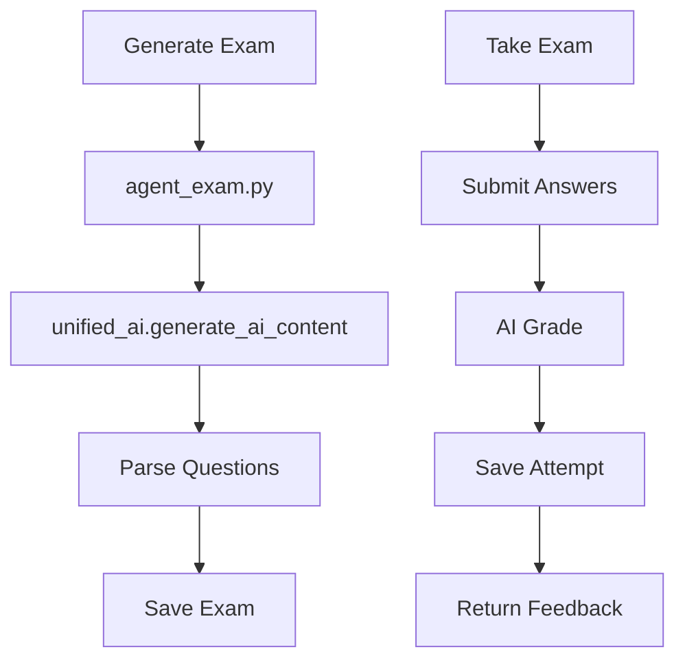

# Exams Module Context

## Purpose

AI-powered exam generation and grading:
- Multiple question types (multiple choice, fill-in, translation, essay)
- AI grading with feedback
- Attempt tracking and scoring
- CEFR level targeting

---

## Architecture

### Exam Flow



### Data Models

- **Exam**: title, topic, level, questions JSON, best_score, attempt_count
- **ExamAttempt**: user_answers, feedback, score

---

## Key Files

### Backend
- [agent_exam.py](file:///e:/vocab_web/server/api/agent_exam.py) - LangGraph exam agent
- [ai_views.py](file:///e:/vocab_web/server/api/ai_views.py) - Exam endpoints
- [models.py](file:///e:/vocab_web/server/api/models.py) - Exam, ExamAttempt models

### Frontend
- [ExamPage.jsx](file:///e:/vocab_web/client/src/pages/ExamPage.jsx) - Desktop exam (58k lines)
- [MobileExam.jsx](file:///e:/vocab_web/client/src/pages/mobile/MobileExam.jsx)
- [MobileExamCreate.jsx](file:///e:/vocab_web/client/src/pages/mobile/MobileExamCreate.jsx)
- [MobileExamPlay.jsx](file:///e:/vocab_web/client/src/pages/mobile/MobileExamPlay.jsx)

---

## Question Types

| Type | Description | AI Grading |
|------|-------------|------------|
| multiple_choice | Select correct answer | Exact match |
| fill_in_blank | Complete the sentence | Fuzzy match |
| translation | Translate sentence | Semantic comparison |
| essay | Free-form writing | AI evaluation |

---

## API Endpoints

| Endpoint | Method | Purpose |
|----------|--------|---------|
| `/api/generate-exam/` | POST | Generate new exam |
| `/api/exams/` | GET | List user exams |
| `/api/exams/{id}/` | GET | Get exam |
| `/api/exams/{id}/submit/` | POST | Submit answers |

---

## Request Example

```json
POST /api/generate-exam/
{
    "topic": "Restaurant vocabulary",
    "level": "A2",
    "language": "de",
    "question_count": 10,
    "question_types": ["multiple_choice", "fill_in_blank", "translation"]
}
```

---

## Key Decisions

### Decision: LangGraph for exam generation
- **Why**: Complex multi-step generation needs state management
- **Consequences**: Reliable generation, integrated with AI Gateway
- **Date**: 2025-12-07

---

*Version: 1.0 | Created: 2025-12-10*
