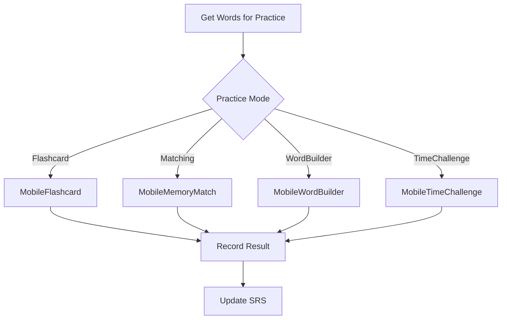

# Games & Practice Module Context

## Purpose

Interactive games and practice modes for vocabulary:
- Flashcard practice
- Memory matching game
- Word builder
- Time challenge
- Spaced repetition practice

---

## Architecture

### Practice Flow

---

## Key Files

### Backend
- [views/practice_views.py](file:///e:/vocab_web/server/api/views/practice_views.py)
- [srs.py](file:///e:/vocab_web/server/api/srs.py) - SuperMemo 2
- [hlr.py](file:///e:/vocab_web/server/api/hlr.py) - Half-Life Regression

### Frontend (Mobile)
- [MobileFlashcard.jsx](file:///e:/vocab_web/client/src/pages/mobile/MobileFlashcard.jsx)
- [MobileMemoryMatch.jsx](file:///e:/vocab_web/client/src/pages/mobile/MobileMemoryMatch.jsx)
- [MobileWordBuilder.jsx](file:///e:/vocab_web/client/src/pages/mobile/MobileWordBuilder.jsx)
- [MobileTimeChallenge.jsx](file:///e:/vocab_web/client/src/pages/mobile/MobileTimeChallenge.jsx)
- [MobileGames.jsx](file:///e:/vocab_web/client/src/pages/mobile/MobileGames.jsx)

---

## API Endpoints

| Endpoint | Method | Purpose |
|----------|--------|---------|
| `/api/practice/words/` | GET | Words due for review |
| `/api/practice/random/` | GET | Random words for games |
| `/api/practice/result/` | POST | Submit practice result |
| `/api/practice/stats/` | GET | Review statistics |
| `/api/games/matching/` | GET | Words for matching game |

---

## Game Modes

| Game | Description | Words |
|------|-------------|-------|
| **Flashcard** | Flip cards, rate difficulty | Due words |
| **Memory Match** | Match word-translation pairs | 6-12 pairs |
| **Word Builder** | Arrange letters to form word | Random |
| **Time Challenge** | Answer quickly for points | Mixed |

---

*Version: 1.0 | Created: 2025-12-10*
