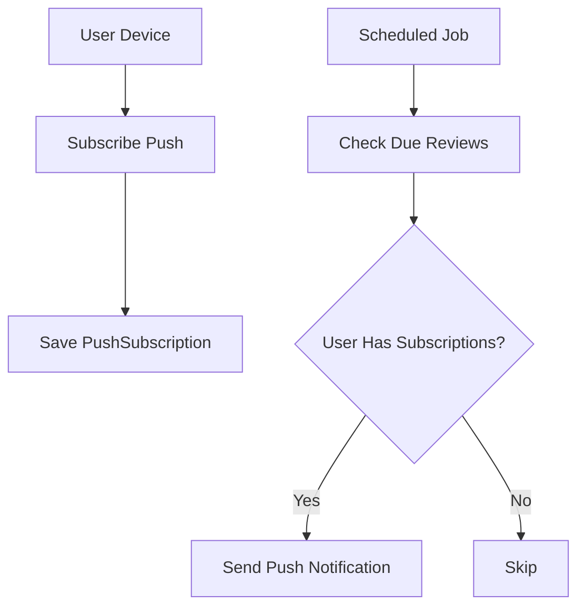

# Notifications Module Context

## Purpose

Push notifications for user engagement:
- Daily practice reminders
- Streak warnings
- Achievement notifications
- Device subscription management

---

## Architecture

### Flow

### Data Models

- **PushSubscription**: endpoint, p256dh_key, auth_key, user_agent
- **NotificationPreferences**: daily_reminder, streak_warning, quiet_hours
- **NotificationLog**: audit trail of sent notifications

---

## Key Files

### Backend
- [notification_views.py](file:///e:/vocab_web/server/api/notification_views.py)
- [notification_models.py](file:///e:/vocab_web/server/api/notification_models.py)

---

## API Endpoints

| Endpoint | Method | Purpose |
|----------|--------|---------|
| `/api/notifications/subscribe/` | POST | Subscribe device |
| `/api/notifications/unsubscribe/` | POST | Unsubscribe device |
| `/api/notifications/preferences/` | GET/PUT | Manage preferences |
| `/api/notifications/status/` | GET | Check subscription status |
| `/api/notifications/test/` | POST | Send test notification |

---

## Notification Types

| Type | Trigger | Content |
|------|---------|---------|
| daily_reminder | Scheduled | "Time to practice!" |
| streak_warning | 23h no activity | "Don't lose your streak!" |
| achievement | Milestone reached | "You mastered 100 words!" |
| new_content | Content ready | "Your story is ready!" |

---

*Version: 1.0 | Created: 2025-12-10*
