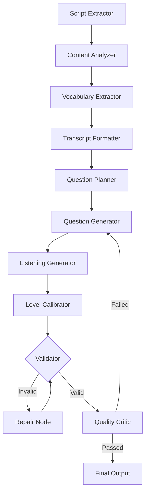

# Podcast Exam Module Context

> **Status**: Planned
> **Owner**: AI Backend Team
> **Last Updated**: 2025-12-20

## Purpose

Generate interactive language learning exams from podcast transcripts using LangGraph. Features listening comprehension with audio clips, vocabulary extraction, and adjustable difficulty.

---

## Architecture (LangGraph)

### Flow Diagram



### Nodes (11 total)

| Node | Purpose |
|------|---------|
| `script_extractor_node` | Load podcast, extract script with timestamps |
| `content_analyzer_node` | Identify themes, grammar patterns |
| `vocabulary_extractor_node` | Extract vocabulary with translations |
| `transcript_formatter_node` | Format for readable display |
| `planner_node` | Decide question distribution |
| `generator_node` | Create questions via AI Gateway |
| `listening_generator_node` | Create audio-clip questions |
| `level_calibrator_node` | Adjust difficulty (-1/0/+1) |
| `validator_node` | Check JSON structure |
| `repair_node` | Fix malformed JSON |
| `critic_node` | Quality review |

---

## Data Models

### `PodcastExam`
- **FK**: `podcast` → Links to source episode
- **Fields**: `questions`, `extracted_vocabulary`, `formatted_transcript`
- **Settings**: `base_level`, `adjusted_level`, `focus`
- **Status**: `processing`, `completed`, `failed`

### `PodcastExamAttempt`
- **FK**: `exam` → Links to PodcastExam
- **Fields**: `user_answers`, `score`, `time_taken`

---

## Question Types (5)

| Type | Description |
|------|-------------|
| `cloze` | Fill-in-the-blank from transcript |
| `multiple_choice` | Content comprehension questions |
| `matching` | Match vocabulary with definitions |
| `reading` | Read excerpt, answer questions |
| `listening` | Play audio clip, answer question |

---

## Key Files

### Backend
- [agent_podcast_exam.py](file:///e:/vocab_web/server/api/agent_podcast_exam.py) - LangGraph agent (NEW)
- [models.py](file:///e:/vocab_web/server/api/models.py) - PodcastExam, PodcastExamAttempt
- [ai_views.py](file:///e:/vocab_web/server/api/ai_views.py) - generate_podcast_exam endpoint

### Frontend
- [MobilePodcastExamCreate.jsx](file:///e:/vocab_web/client/src/pages/mobile/MobilePodcastExamCreate.jsx) - Config page
- [MobilePodcastExamPlay.jsx](file:///e:/vocab_web/client/src/pages/mobile/MobilePodcastExamPlay.jsx) - Exam player
- [TranscriptReview.jsx](file:///e:/vocab_web/client/src/components/mobile/TranscriptReview.jsx) - Readable transcript
- [ListeningQuestion.jsx](file:///e:/vocab_web/client/src/components/mobile/ListeningQuestion.jsx) - Audio questions

---

## API Endpoints

| Endpoint | Method | Purpose |
|----------|--------|---------|
| `/api/generate-podcast-exam/` | POST | Generate exam from podcast |
| `/api/podcast-exams/` | GET | List user's podcast exams |
| `/api/podcast-exams/{id}/` | GET | Get exam details |
| `/api/podcast-exams/{id}/submit/` | POST | Submit answers |

---

## Request Example

```json
POST /api/generate-podcast-exam/
{
    "podcast_id": 123,
    "question_count": 10,
    "question_types": ["cloze", "multiple_choice", "matching", "reading", "listening"],
    "focus": "vocabulary",
    "difficulty_adjustment": 0
}
```

---

## Features

| Feature | Description |
|---------|-------------|
| **Listening Comprehension** | Audio clips with timestamps |
| **Vocabulary Extraction** | Auto-detect words, add to list |
| **Difficulty Slider** | Adjust level -1/0/+1 |
| **Question Focus** | Vocabulary, Grammar, Comprehension, Mixed |
| **Readable Transcript** | Font sizes S/M/L/XL, speaker colors |

---

## Implementation Workflows

1. `/podcast-exam-models` - Create database models
2. `/podcast-exam-agent` - Create LangGraph agent
3. `/podcast-exam-api` - Create API endpoints
4. `/podcast-exam-frontend` - Create frontend components

---

## Key Decisions

### Decision: Use separate PodcastExam model
- **Why**: Different features (vocabulary, transcript, listening) than regular Exam
- **Consequences**: New model, but cleaner separation of concerns
- **Date**: 2025-12-20

### Decision: 11-node LangGraph pipeline
- **Why**: Complex extraction and generation requires multi-step processing
- **Consequences**: More AI calls, but higher quality output
- **Date**: 2025-12-20

---

*Version: 1.0 | Created: 2025-12-20*
