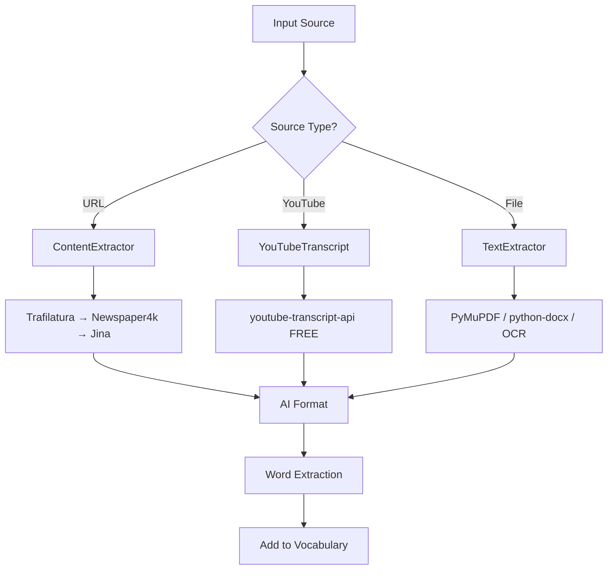

# Smart Reader Module Context

## Purpose

Extract and process content from multiple sources:
- URL/article extraction
- YouTube transcript extraction
- File extraction (PDF, DOCX, PPTX, XLSX, images)
- AI-powered formatting and summarization
- Word extraction for vocabulary practice

---

## Architecture

### Extraction Flow



### URL Extraction Fallback Chain

1. **Trafilatura** - 93.7% F1 score, primary
2. **Newspaper4k** - 90.2% F1, news sites
3. **Jina Reader API** - JavaScript-heavy sites (FREE 20/min)

---

## Key Files

### Backend Services
- [content_extraction_service.py](file:///e:/vocab_web/server/api/content_extraction_service.py) - URL/YouTube
- [text_extraction_service.py](file:///e:/vocab_web/server/api/text_extraction_service.py) - Files
- [text_formatting_service.py](file:///e:/vocab_web/server/api/text_formatting_service.py) - AI formatting
- [ocrspace_service.py](file:///e:/vocab_web/server/api/ocrspace_service.py) - OCR API
- [file_type_registry.py](file:///e:/vocab_web/server/api/file_type_registry.py) - File detection

### Views
- [content_extraction_views.py](file:///e:/vocab_web/server/api/content_extraction_views.py)
- [text_extraction_views.py](file:///e:/vocab_web/server/api/text_extraction_views.py)

### Frontend
- [MobileReader.jsx](file:///e:/vocab_web/client/src/pages/mobile/MobileReader.jsx) - Main UI (1148 lines)
- [TextReader.jsx](file:///e:/vocab_web/client/src/pages/TextReader.jsx) - Desktop reader

---

## Supported File Types

| Type | Extensions | Method |
|------|------------|--------|
| PDF | .pdf | PyMuPDF + OCR fallback |
| Word | .docx | python-docx |
| PowerPoint | .pptx | python-pptx |
| Excel | .xlsx | openpyxl |
| Images | .jpg, .png | Tesseract / OCR.space |
| Text | .txt, .md | Direct read |

---

## API Endpoints

| Endpoint | Method | Purpose |
|----------|--------|---------|
| `/api/extract-content/` | POST | Extract from URL |
| `/api/extract-youtube/` | POST | YouTube transcript |
| `/api/extract-text/` | POST | Extract from file |
| `/api/format-text/` | POST | AI format content |
| `/api/extract-words/` | POST | Find new vocabulary |

---

## Key Decisions

### Decision: youtube-transcript-api instead of YouTube API
- **Why**: FREE, unlimited, no API key required
- **Consequences**: Depends on auto-captions availability
- **Date**: 2025-12-06

### Decision: Trafilatura as primary URL extractor
- **Why**: Best F1 score (93.7%), active maintenance
- **Consequences**: Some JS-heavy sites need Jina fallback
- **Date**: 2025-12-06

---

## Usage Example

```python
from api.content_extraction_service import extract_content_from_url

# Extract article
result = extract_content_from_url("https://example.com/article")
print(result["content"])
print(result["title"])
print(result["word_count"])

# Extract YouTube transcript
from api.content_extraction_service import extract_youtube_transcript
result = extract_youtube_transcript("dQw4w9WgXcQ", preferred_language="de")
```

---

*Version: 1.0 | Created: 2025-12-10*
