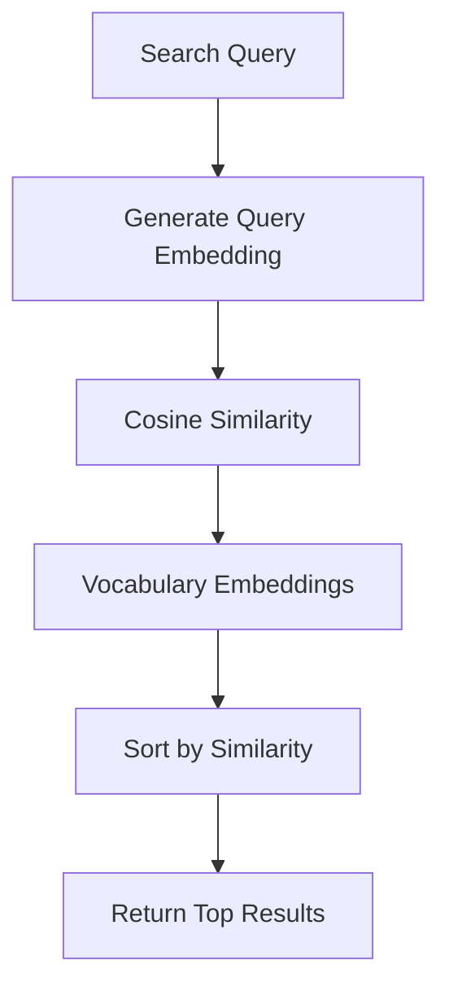

# Semantic Search Module Context

## Purpose

Vector-based semantic search for vocabulary:
- Generate embeddings for vocabulary
- Find semantically similar words
- Natural language vocabulary queries

---

## Architecture

### Flow



### Provider
- **OpenRouter API** - text-embedding-3-small model
- **Dimension**: 1536

---

## Key Files

### Backend
- [semantic_search_views.py](file:///e:/vocab_web/server/api/semantic_search_views.py)
- [embedding_service.py](file:///e:/vocab_web/server/api/embedding_service.py)

---

## API Endpoints

| Endpoint | Method | Purpose |
|----------|--------|---------|
| `/api/vocab/semantic-search/` | POST | Search vocabulary |
| `/api/vocab/generate-embeddings/` | POST | Generate embeddings |
| `/api/vocab/validate-openrouter/` | POST | Validate API key |

---

## Usage Example

```json
POST /api/vocab/semantic-search/
{
    "query": "words about food and eating",
    "api_key": "sk-or-...",
    "limit": 10
}

Response:
{
    "results": [
        {"vocab": {...}, "similarity": 0.85},
        {"vocab": {...}, "similarity": 0.82}
    ],
    "total": 15
}
```

---

## Key Decisions

### Decision: OpenRouter for embeddings
- **Why**: Unified API, access to OpenAI models
- **Consequences**: Requires API key, per-request cost
- **Date**: 2025-11-27

---

*Version: 1.0 | Created: 2025-12-10*
