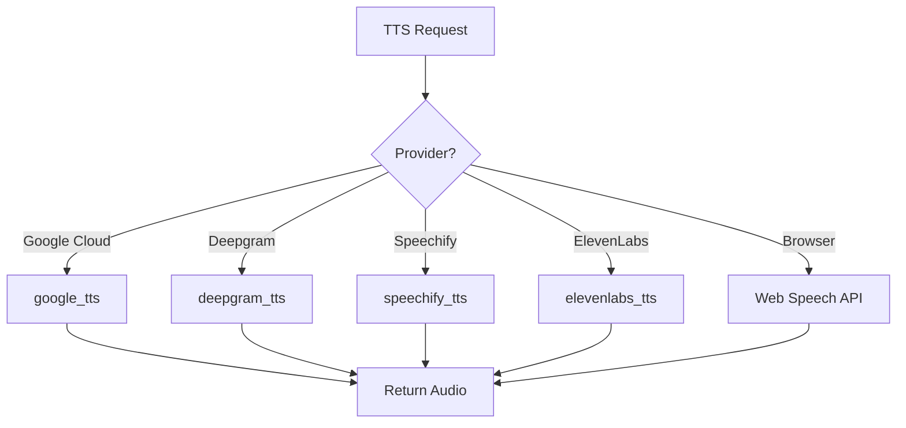
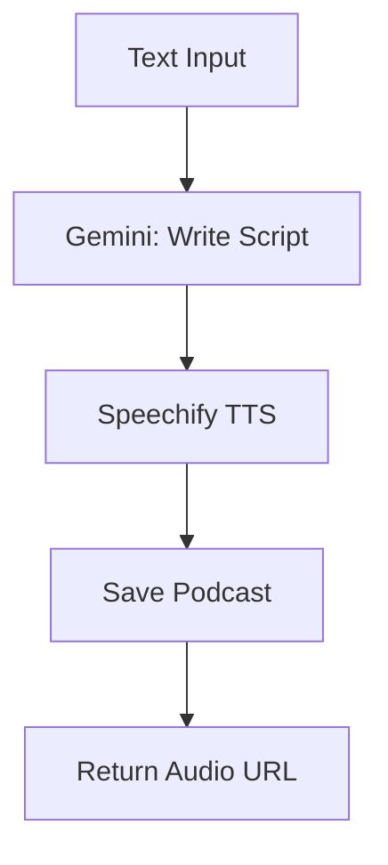

# TTS Module Context

## Purpose

Text-to-speech for language learning:
- Multiple TTS providers
- Podcast creation from text
- Word pronunciation
- Browser fallback (free)

---

## Architecture

### TTS Flow



### Podcast Creation Flow



### Providers

| Provider | Quality | Free Tier | API Key |
|----------|---------|-----------|---------|
| Google Cloud TTS | Best | Limited | Required |
| Deepgram | Good | 200 chars | Required |
| Speechify | Good | Limited | Required |
| ElevenLabs | Excellent | 10k chars/mo | Required |
| Browser | Basic | Unlimited | None |

---

## Key Files

### Backend
- [tts_views.py](file:///e:/vocab_web/server/api/tts_views.py) - TTS endpoints
- [feature_views.py](file:///e:/vocab_web/server/api/feature_views.py) - generate_podcast, validate_elevenlabs_key

### Frontend
- [PodcastCreator.jsx](file:///e:/vocab_web/client/src/pages/PodcastCreator.jsx)
- [MyPodcasts.jsx](file:///e:/vocab_web/client/src/pages/MyPodcasts.jsx)
- Browser TTS in MobileReader.jsx

---

## API Endpoints

| Endpoint | Method | Purpose |
|----------|--------|---------|
| `/api/tts/generate/` | POST | Generate speech |
| `/api/tts/voices/` | GET | List all voices |
| `/api/tts/voices/{lang}/` | GET | Voices for language |
| `/api/tts/validate/` | POST | Validate Google TTS key |
| `/api/tts/validate-deepgram/` | POST | Validate Deepgram key |
| `/api/tts/validate-speechify/` | POST | Validate Speechify key |
| `/api/generate-podcast/` | POST | Create podcast |
| `/api/podcasts/` | GET/POST | Manage podcasts |

---

## Browser TTS (Free)

```javascript
// Used in MobileReader.jsx
const utterance = new SpeechSynthesisUtterance(text);
utterance.lang = 'de-DE';
speechSynthesis.speak(utterance);
```

---

*Version: 1.1 | Updated: 2025-12-10*

---

*Version: 1.0 | Created: 2025-12-10*
