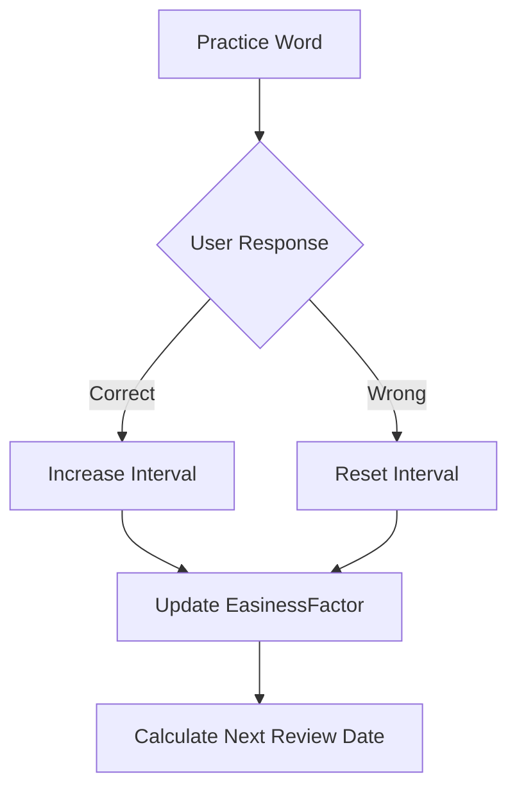
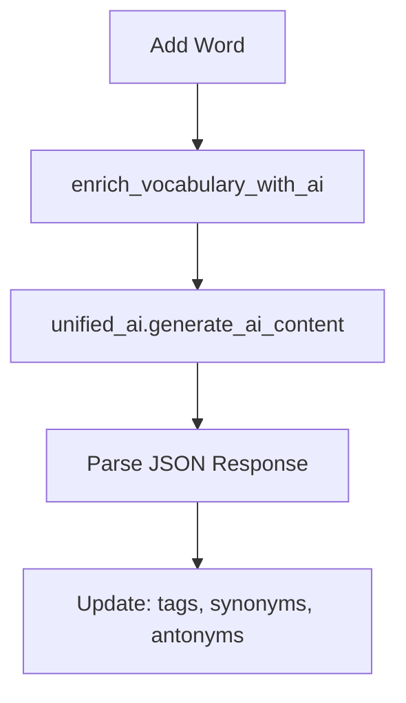

# Vocabulary Module Context

## Purpose

Core vocabulary management with spaced repetition:
- Word CRUD operations
- Tagging and categorization
- SRS algorithms (SuperMemo 2, HLR)
- Progress tracking
- CSV import/export
- Public vocabulary sharing
- AI-powered enrichment

---

## Architecture

### SRS Flow



### AI Enrichment Flow



### Data Models

- **Vocabulary**: word, translation, type, examples, audio_url, embedding
- **Tag**: user-defined word categories
- **UserProgress**: SRS state per word (interval, easiness, next_review)
- **Quiz**: practice session results

---

## Key Files

### Backend
- [models.py](file:///e:/vocab_web/server/api/models.py) - Vocabulary, Tag, UserProgress
- [views/vocab_views.py](file:///e:/vocab_web/server/api/views/vocab_views.py) - ViewSets
- [srs.py](file:///e:/vocab_web/server/api/srs.py) - SuperMemo 2 algorithm
- [hlr.py](file:///e:/vocab_web/server/api/hlr.py) - Half-Life Regression
- [prompts.py](file:///e:/vocab_web/server/api/prompts.py) - ContextEngineer class
- [serializers.py](file:///e:/vocab_web/server/api/serializers.py)

### Frontend
- [VocabList.jsx](file:///e:/vocab_web/client/src/pages/VocabList.jsx) - Desktop vocab list
- [AddWord.jsx](file:///e:/vocab_web/client/src/pages/AddWord.jsx) - Add vocabulary
- [MobileWords.jsx](file:///e:/vocab_web/client/src/pages/mobile/MobileWords.jsx)
- [MobileFlashcard.jsx](file:///e:/vocab_web/client/src/pages/mobile/MobileFlashcard.jsx)

---

## API Endpoints

| Endpoint | Method | Purpose |
|----------|--------|---------|
| `/api/vocab/` | GET/POST | List/Add vocabulary |
| `/api/vocab/{id}/` | PUT/DELETE | Update/Delete word |
| `/api/vocab/by-status/` | GET | Filter by HLR status |
| `/api/vocab/export_csv/` | GET | Export to CSV |
| `/api/vocab/import_csv/` | POST | Import from CSV |
| `/api/public-vocab/` | GET | Browse public vocabulary |
| `/api/public-vocab/{id}/copy/` | POST | Copy word to own bank |
| `/api/tags/` | GET/POST | Manage tags |

---

## CSV Format

```csv
word,translation,type,example,tags,synonyms,antonyms
Hund,dog,noun,"Der Hund läuft.","animals,pets","Köter,Tier","Katze"
```

---

## Key Decisions

### Decision: AI enrichment via unified_ai
- **Why**: Auto-generate tags, synonyms, antonyms
- **Consequences**: Uses AI quota, optional feature
- **Date**: 2025-11-27

---

*Version: 1.1 | Updated: 2025-12-10*

---

## Common Tasks

### Add new word type
1. Update `WORD_TYPES` in `Vocabulary` model
2. Add migration
3. Update serializer

### Modify SRS algorithm
1. Update `srs.py` or `hlr.py`
2. Test with existing progress data
3. Consider migration for existing intervals

---

*Version: 1.0 | Created: 2025-12-10*
