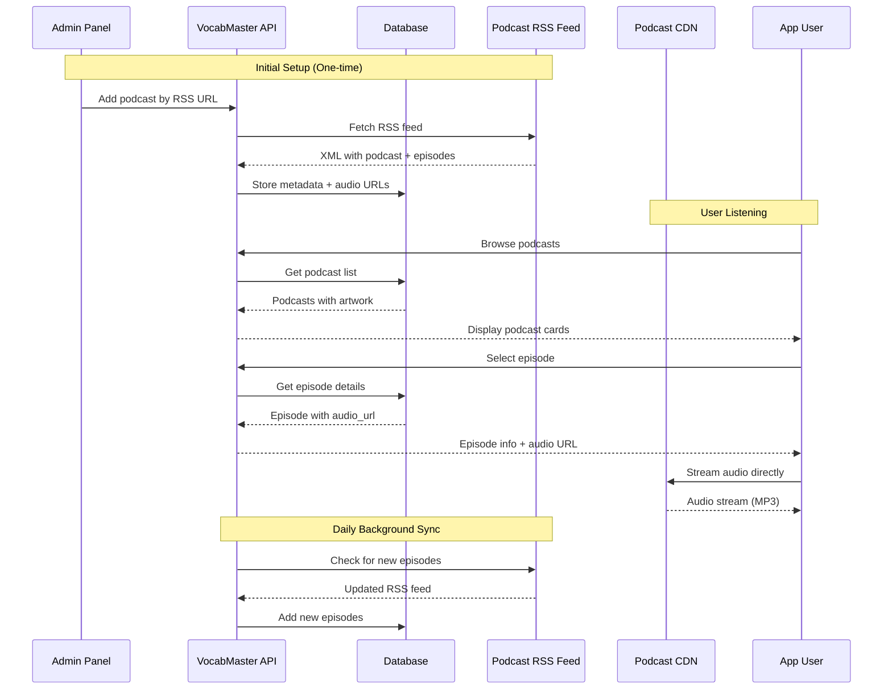

# External Podcast Integration Guide

> **Goal**: Access and display real-world podcasts (like DW, Easy German, etc.) in VocabMaster without downloading/re-uploading audio files.
> **Status**: Research Complete
> **Created**: 2025-12-20

---

## 🎯 The Secret: RSS Feeds

**All podcasts are distributed via RSS feeds** - XML files containing:
- Podcast metadata (title, description, artwork)
- Episode list with titles, descriptions, dates
- **Direct URLs to audio files** (stream directly, no download needed!)

Apps like Miraa, Pocket Casts, and Spotify simply:
1. Parse the RSS feed
2. Display episode info
3. Stream audio directly from the source URL

**You don't need to download and re-upload anything!**

---

## 📊 Reference: Miraa App Screenshots


---

## 🔑 All Ways to Get Podcasts

### Comparison Table

| Method | Free? | Rate Limit | Transcripts | Best For |
|--------|-------|------------|-------------|----------|
| **Direct RSS Parsing** | ✅ Unlimited | None | ❌ | Full control, known feeds |
| **PodcastIndex.org** | ✅ FREE | Generous | ❌ | Open source, 4M+ podcasts |
| **iTunes/Apple API** | ✅ FREE | 20/min | ❌ | Finding RSS feed URLs |
| **Listen Notes** | 🟡 300/mo free | Paid tiers | ❌ | Search & discovery |
| **Taddy API** | 🟡 500/mo free | Paid tiers | ✅ (paid) | GraphQL, transcripts |
| **Podchaser** | 🟡 Free tier | Limited | ❌ | Charts, reviews |

---

### Option 1: Direct RSS Feed Parsing (FREE - Recommended)

**How it works**: Parse RSS feeds directly from podcast providers.

```
Your App → HTTP GET RSS Feed URL → Parse XML → Display Episodes → Stream Audio
```

**The `<enclosure>` tag** in RSS is the key - it contains:
- `url`: Direct link to audio file (e.g., `https://cdn.dw.com/episode.mp3`)
- `length`: File size in bytes
- `type`: MIME type (`audio/mpeg`)

```xml
<item>
  <title>Episode 1: Welcome</title>
  <enclosure url="https://cdn.example.com/ep1.mp3" 
             length="12345678" 
             type="audio/mpeg" />
  <itunes:duration>14:57</itunes:duration>
</item>
```

**Pros**:
- 100% FREE, no API limits
- Direct access to audio files
- Works with any podcast

**Cons**:
- Need to manually collect RSS feed URLs initially
- Must handle XML parsing

---

### Option 2: PodcastIndex.org API (FREE - Open Source)

The **best free option** for discovering podcasts.

```
https://podcastindex.org/
API Docs: https://podcastindex-org.github.io/docs-api
```

**Features**:
- 🆓 FREE API (requires registration)
- 📚 4+ million podcasts indexed
- 🔍 Search by title, author, keyword
- 📋 Returns RSS feed URLs
- 🔓 Open source, community-driven
- 📦 Weekly SQLite database dumps available!

**Example API Call**:
```python
import hashlib
import time
import requests

API_KEY = "your_key"
API_SECRET = "your_secret"

# Generate auth headers
epoch = str(int(time.time()))
auth_string = API_KEY + API_SECRET + epoch
auth_hash = hashlib.sha1(auth_string.encode()).hexdigest()

headers = {
    "X-Auth-Key": API_KEY,
    "X-Auth-Date": epoch,
    "Authorization": auth_hash,
    "User-Agent": "VocabMaster/1.0"
}

# Search for German learning podcasts
response = requests.get(
    "https://api.podcastindex.org/api/1.0/search/byterm",
    params={"q": "German learning"},
    headers=headers
)

for podcast in response.json()['feeds']:
    print(f"{podcast['title']}: {podcast['url']}")
```

---

### Option 3: iTunes/Apple Podcasts API (FREE)

**Perfect for** getting RSS feed URLs from podcast names.

```
https://itunes.apple.com/search?term=german+learning&entity=podcast
```

**No API key required!**

**Example Response**:
```json
{
  "results": [
    {
      "trackName": "Easy German: Learn German",
      "feedUrl": "https://feeds.simplecast.com/xxx",
      "artworkUrl600": "https://...",
      "collectionId": 123456,
      "releaseDate": "2025-12-18"
    }
  ]
}
```

**Python Example**:
```python
import requests

def find_podcast_rss(name: str) -> str:
    """Find RSS feed URL via iTunes API."""
    response = requests.get(
        "https://itunes.apple.com/search",
        params={
            "term": name,
            "entity": "podcast",
            "limit": 1
        }
    )
    results = response.json().get("results", [])
    if results:
        return results[0].get("feedUrl")
    return None

# Usage
rss_url = find_podcast_rss("Easy German")
print(rss_url)  # https://feeds.simplecast.com/...
```

**Rate Limit**: ~20 requests/minute (free)

---

### Option 4: Listen Notes API (Freemium)

Best podcast search engine API.

```
https://www.listennotes.com/api/
```

**Free Tier**:
- 300 requests/month
- 30 search results per query
- No credit card required

**Python Example**:
```python
import requests

headers = {"X-ListenAPI-Key": "your_api_key"}

response = requests.get(
    "https://listen-api.listennotes.com/api/v2/search",
    headers=headers,
    params={"q": "German learning", "type": "podcast"}
)

for podcast in response.json()['results']:
    print(f"{podcast['title']}: {podcast['rss']}")
```

---

### Option 5: Taddy API (GraphQL, Transcripts)

Premium features with free tier.

```
https://taddy.org/
```

**Free Tier**: 500 requests/month

**Unique Feature**: Episode transcripts! (creator-provided free, generated $75/mo)

**GraphQL Example**:
```graphql
query {
  searchForPodcast(term: "German Learning") {
    searchId
    podcastSeries {
      uuid
      name
      rssUrl
      description
    }
  }
}
```

---

## 📥 OPML Import Support

**OPML** (Outline Processor Markup Language) is the standard format for sharing podcast subscriptions.

Users can export their subscriptions from any podcast app and import into yours!

**OPML Structure**:
```xml
<?xml version="1.0" encoding="UTF-8"?>
<opml version="2.0">
  <head>
    <title>My Podcasts</title>
  </head>
  <body>
    <outline text="German Learning" title="German Learning">
      <outline type="rss" 
               text="Easy German" 
               xmlUrl="https://feeds.simplecast.com/xxx"
               htmlUrl="https://www.easygerman.org"/>
      <outline type="rss" 
               text="DW Langsam" 
               xmlUrl="https://rss.dw.com/xml/rss-de-langsamdeutsch"/>
    </outline>
  </body>
</opml>
```

**Python Parser**:
```python
import xml.etree.ElementTree as ET

def parse_opml(opml_content: str) -> list:
    """Parse OPML file and extract podcast RSS URLs."""
    root = ET.fromstring(opml_content)
    podcasts = []
    
    for outline in root.findall('.//outline[@xmlUrl]'):
        podcasts.append({
            'name': outline.get('text') or outline.get('title'),
            'feed_url': outline.get('xmlUrl'),
            'website': outline.get('htmlUrl')
        })
    
    return podcasts
```

---

## 🎤 Transcription Options

For language learning, transcripts are essential! Here's how to get them:

### Option 1: Use Provided Transcripts

Some podcasts include transcripts in their RSS feeds:
- `<content:encoded>` tag (HTML content)
- `<itunes:subtitle>` tag
- Separate transcript files linked in description

### Option 2: OpenAI Whisper API

**Best for**: Auto-transcribing episodes without transcripts.

```python
from openai import OpenAI
import requests

client = OpenAI()

def transcribe_episode(audio_url: str) -> str:
    """Transcribe podcast episode using Whisper."""
    # Download audio (max 25MB)
    response = requests.get(audio_url)
    
    with open("temp_episode.mp3", "wb") as f:
        f.write(response.content)
    
    with open("temp_episode.mp3", "rb") as audio_file:
        transcription = client.audio.transcriptions.create(
            model="whisper-1",
            file=audio_file,
            response_format="srt",  # or "text", "vtt"
            language="de"  # Specify language for accuracy
        )
    
    return transcription.text
```

**Features**:
- 100+ languages supported
- Word-level timestamps available
- ~$0.006 per minute

### Option 3: Free Whisper (Self-hosted)

Run Whisper locally for free (but slower):

```python
import whisper

model = whisper.load_model("base")
result = model.transcribe("episode.mp3", language="de")
print(result["text"])
```

---

## 🏗️ Proposed Architecture

### New Models

```python
class ExternalPodcast(models.Model):
    """External podcast from RSS feed (not AI-generated)."""
    
    # Identity
    name = models.CharField(max_length=200)
    feed_url = models.URLField(unique=True)
    artwork_url = models.URLField(blank=True)
    author = models.CharField(max_length=200, blank=True)
    description = models.TextField(blank=True)
    website_url = models.URLField(blank=True)
    
    # Target audience
    LEVEL_CHOICES = [
        ('A1', 'A1 - Beginner'),
        ('A2', 'A2 - Elementary'),
        ('B1', 'B1 - Intermediate'),
        ('B2', 'B2 - Upper Intermediate'),
        ('C1', 'C1 - Advanced'),
        ('C2', 'C2 - Mastery'),
    ]
    level = models.CharField(max_length=2, choices=LEVEL_CHOICES, default='B1')
    language = models.CharField(max_length=2, default='de')
    
    # Metadata
    episode_count = models.IntegerField(default=0)
    last_synced_at = models.DateTimeField(null=True)
    is_active = models.BooleanField(default=True)
    is_featured = models.BooleanField(default=False)
    
    # Source tracking
    itunes_id = models.CharField(max_length=50, blank=True)
    podcastindex_id = models.CharField(max_length=50, blank=True)
    
    created_at = models.DateTimeField(auto_now_add=True)
    
    class Meta:
        ordering = ['name']


class ExternalEpisode(models.Model):
    """Episode from external podcast RSS feed."""
    
    podcast = models.ForeignKey(ExternalPodcast, on_delete=models.CASCADE, related_name='episodes')
    
    # From RSS
    guid = models.CharField(max_length=500, unique=True)  # RSS GUID
    title = models.CharField(max_length=500)
    description = models.TextField(blank=True)
    audio_url = models.URLField()  # Direct stream URL!
    duration = models.IntegerField(default=0)  # seconds
    published_at = models.DateTimeField()
    file_size = models.BigIntegerField(default=0)  # bytes
    
    # Optional enhancements
    transcript = models.TextField(blank=True)
    transcript_source = models.CharField(max_length=20, blank=True)  # 'rss', 'whisper', 'manual'
    image_url = models.URLField(blank=True)
    
    # User engagement
    listen_count = models.IntegerField(default=0)
    
    created_at = models.DateTimeField(auto_now_add=True)
    
    class Meta:
        ordering = ['-published_at']


class ExternalPodcastSubscription(models.Model):
    """User subscription to an external podcast."""
    
    user = models.ForeignKey(User, on_delete=models.CASCADE, related_name='podcast_subscriptions')
    podcast = models.ForeignKey(ExternalPodcast, on_delete=models.CASCADE)
    
    # Progress tracking
    last_played_episode = models.ForeignKey(ExternalEpisode, null=True, on_delete=models.SET_NULL)
    last_position = models.IntegerField(default=0)  # seconds
    
    created_at = models.DateTimeField(auto_now_add=True)
    
    class Meta:
        unique_together = ['user', 'podcast']
```

---

### RSS Feed Parser Service

```python
# server/api/services/podcast_feed_service.py

import feedparser
from datetime import datetime
from typing import List, Dict, Optional
from email.utils import parsedate_to_datetime

class PodcastFeedService:
    """Service to parse podcast RSS feeds."""
    
    def parse_feed(self, feed_url: str) -> Dict:
        """Parse an RSS feed and return podcast + episodes data."""
        feed = feedparser.parse(feed_url)
        
        if feed.bozo:
            raise ValueError(f"Invalid RSS feed: {feed.bozo_exception}")
        
        podcast_data = {
            'name': feed.feed.get('title', 'Unknown'),
            'description': feed.feed.get('description', ''),
            'author': feed.feed.get('author', feed.feed.get('itunes_author', '')),
            'artwork_url': self._get_artwork(feed),
            'website_url': feed.feed.get('link', ''),
            'language': feed.feed.get('language', 'de')[:2],
            'episodes': []
        }
        
        for entry in feed.entries:
            audio_url = self._get_audio_url(entry)
            if not audio_url:
                continue  # Skip entries without audio
            
            episode = {
                'guid': entry.get('id', entry.get('link', audio_url)),
                'title': entry.get('title', 'Untitled'),
                'description': self._clean_description(entry),
                'audio_url': audio_url,
                'duration': self._parse_duration(entry),
                'published_at': self._parse_date(entry),
                'image_url': self._get_episode_image(entry),
                'file_size': self._get_file_size(entry),
                'transcript': self._get_transcript(entry)
            }
            podcast_data['episodes'].append(episode)
        
        return podcast_data
    
    def _get_audio_url(self, entry) -> Optional[str]:
        """Extract audio URL from RSS entry enclosure tag."""
        # Check enclosures first (standard podcast format)
        for enc in entry.get('enclosures', []):
            if enc.get('type', '').startswith('audio/'):
                return enc.get('href')
        
        # Fallback: check links
        for link in entry.get('links', []):
            if link.get('type', '').startswith('audio/'):
                return link.get('href')
        
        return None
    
    def _get_artwork(self, feed) -> str:
        """Extract podcast artwork URL."""
        # iTunes image
        if hasattr(feed.feed, 'image'):
            if isinstance(feed.feed.image, dict):
                return feed.feed.image.get('href', '')
            return getattr(feed.feed.image, 'href', '')
        
        # iTunes image tag
        itunes_image = getattr(feed.feed, 'itunes_image', None)
        if itunes_image:
            return itunes_image.get('href', '') if isinstance(itunes_image, dict) else ''
        
        return ''
    
    def _parse_duration(self, entry) -> int:
        """Parse duration string to seconds."""
        duration_str = entry.get('itunes_duration', '0')
        try:
            # Handle HH:MM:SS format
            parts = str(duration_str).split(':')
            if len(parts) == 3:
                return int(parts[0]) * 3600 + int(parts[1]) * 60 + int(parts[2])
            elif len(parts) == 2:
                return int(parts[0]) * 60 + int(parts[1])
            return int(duration_str)
        except:
            return 0
    
    def _parse_date(self, entry) -> datetime:
        """Parse published date."""
        try:
            return parsedate_to_datetime(entry.get('published', ''))
        except:
            return datetime.now()
    
    def _get_file_size(self, entry) -> int:
        """Get file size from enclosure."""
        for enc in entry.get('enclosures', []):
            if enc.get('length'):
                try:
                    return int(enc.get('length'))
                except:
                    pass
        return 0
    
    def _clean_description(self, entry) -> str:
        """Clean HTML from description."""
        import re
        desc = entry.get('summary', entry.get('description', ''))
        # Remove HTML tags
        clean = re.sub(r'<[^>]+>', '', desc)
        return clean.strip()
    
    def _get_episode_image(self, entry) -> str:
        """Get episode-specific image."""
        itunes_image = entry.get('itunes_image', {})
        if isinstance(itunes_image, dict):
            return itunes_image.get('href', '')
        return ''
    
    def _get_transcript(self, entry) -> str:
        """Extract transcript if available in RSS."""
        # Some podcasts include transcript in content:encoded
        content = entry.get('content', [])
        if content and isinstance(content, list):
            for c in content:
                if c.get('type') == 'text/plain':
                    return c.get('value', '')
        return ''
```

---

### Background Sync with Celery

```python
# server/api/tasks.py

from celery import shared_task
from celery.schedules import crontab
from .models import ExternalPodcast, ExternalEpisode
from .services.podcast_feed_service import PodcastFeedService

@shared_task
def sync_podcast_feed(podcast_id: int):
    """Sync a single podcast from its RSS feed."""
    podcast = ExternalPodcast.objects.get(id=podcast_id)
    service = PodcastFeedService()
    
    try:
        data = service.parse_feed(podcast.feed_url)
        
        # Update podcast metadata
        podcast.name = data['name']
        podcast.description = data['description']
        podcast.author = data['author']
        podcast.artwork_url = data['artwork_url']
        
        # Sync episodes
        new_count = 0
        for ep_data in data['episodes']:
            _, created = ExternalEpisode.objects.update_or_create(
                guid=ep_data['guid'],
                defaults={**ep_data, 'podcast': podcast}
            )
            if created:
                new_count += 1
        
        podcast.episode_count = podcast.episodes.count()
        podcast.last_synced_at = timezone.now()
        podcast.save()
        
        return f"Synced {podcast.name}: {new_count} new episodes"
    except Exception as e:
        return f"Error syncing {podcast.name}: {str(e)}"


@shared_task
def sync_all_podcasts():
    """Sync all active podcasts (run daily)."""
    podcasts = ExternalPodcast.objects.filter(is_active=True)
    for podcast in podcasts:
        sync_podcast_feed.delay(podcast.id)


# Celery Beat schedule (settings.py)
CELERY_BEAT_SCHEDULE = {
    'sync-podcasts-daily': {
        'task': 'api.tasks.sync_all_podcasts',
        'schedule': crontab(hour=4, minute=0),  # Daily at 4 AM
    },
}
```

---

## 📋 Curated List of German Learning Podcasts

| Podcast | Level | RSS Feed |
|---------|-------|----------|
| **DW - Langsam Gesprochene Nachrichten** | B2-C1 | `https://rss.dw.com/xml/rss-de-langsamdeutsch` |
| **DW - Top-Thema mit Vokabeln** | B1 | `https://rss.dw.com/xml/DKpodcast_topthema_de` |
| **DW - Alltagsdeutsch** | B2 | `https://rss.dw.com/xml/DKpodcast_alltagsdeutsch_de` |
| **DW - Deutschtrainer** | A1-A2 | `https://rss.dw.com/xml/dwn_podcast_deutschtrainer` |
| **DW - Das sagt man so!** | B1-B2 | `https://rss.dw.com/xml/DKpodcast_dassagtmanso_de` |
| **DW - Sprachbar** | C1 | `https://rss.dw.com/xml/DKpodcast_sprachbar_de` |
| **Easy German** | A2-B1 | Via iTunes API |
| **Coffee Break German** | A1-B1 | Via iTunes API |
| **14 Minuten** | B1-B2 | Via iTunes API |
| **Deutsch Podcast** | A2-B1 | Via iTunes API |
| **Auf Deutsch Gesagt** | A2-B1 | Via iTunes API |
| **kurz & bündig** | B1 | Via iTunes API |
| **Deutsch aber Schwarz** | B1-B2 | Via iTunes API |
| **Nicos Weg (DW)** | A1-B1 | Via iTunes API |

---

## 🚀 Implementation Strategy

### Phase 1: Core Infrastructure (Week 1)
1. Create `ExternalPodcast` and `ExternalEpisode` models
2. Create RSS parser service using `feedparser` + `podcastparser`
3. Add admin endpoints to add/sync podcasts
4. Pre-populate with 15-20 German learning podcasts
5. Add iTunes API search endpoint

### Phase 2: User Features (Week 2)
1. Create `MobileExternalPodcastLibrary.jsx` (browse all podcasts)
2. Create `MobileExternalPodcastDetail.jsx` (episode list)
3. Create `MobileExternalEpisodePlayer.jsx` (player with streaming)
4. Add user subscriptions
5. Add OPML import/export

### Phase 3: Automation & Enhancement (Week 3)
1. Set up Celery Beat for daily RSS sync
2. Add PodcastIndex.org search integration
3. Implement basic progress tracking
4. Add episode bookmarking

### Phase 4: Learning Integration (Week 4)
1. Link external episodes to PodcastExam feature
2. Add Whisper transcription for episodes without transcripts
3. Enable vocabulary extraction from transcripts
4. Create exams from external podcast episodes

---

## ⚖️ Legal Considerations

**Good News**: Podcast RSS feeds are designed for public consumption!

| ✅ OK to Do | ❌ Avoid |
|-------------|----------|
| Parse public RSS feeds | Download and re-host audio |
| Stream audio from source | Remove/skip ads |
| Display episode metadata | Modify podcast content |
| Cache metadata locally | Claim content as yours |

**Best Practice**:
- Display "Powered by [Podcast Name]" credit
- Link back to original podcast page
- Include podcast author/publisher info
- Respect `<itunes:block>` tag if present

---

## 📦 Required Packages

```bash
# For RSS parsing
pip install feedparser podcastparser

# Optional: For Celery background sync
pip install celery redis django-celery-beat

# Optional: For OPML parsing
# (No extra package needed - use xml.etree.ElementTree)

# Optional: For transcription
pip install openai  # Whisper API
# OR
pip install openai-whisper  # Self-hosted
```

---

## 🔄 Summary: How It Works



**Key Point**: Audio files stay on the original server (DW, etc.) - you just store metadata and stream directly!

---

*Research Version: 2.0 | Created: 2025-12-20 | 15 sources researched*
