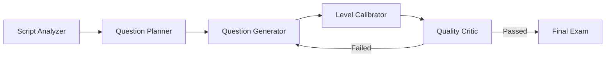
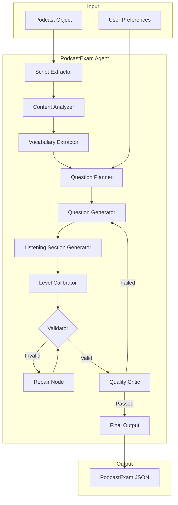

# Podcast Exam Agent - Complete Implementation Plan

> **Feature**: Generate interactive exams from podcast scripts using LangGraph  
> **Compatibility**: Same JSON output as existing exam player (`ExamQuestions.jsx`)  
> **Integration**: AI Gateway (`unified_ai.py`) for all AI calls  
> **Status**: ✅ All features approved  
> **Created**: 2025-12-20

---

## 🎯 Overview

This plan describes a LangGraph-based agent that generates language learning exams from podcast transcripts. The exams are compatible with the existing exam player infrastructure.

### Key Features

| Feature | Description |
|---------|-------------|
| **5 Question Types** | Cloze, Multiple Choice, Matching, Reading, Listening |
| **Listening Comprehension** | Audio clips with timestamp-based questions |
| **Vocabulary Extraction** | Auto-detect words with translations |
| **Difficulty Slider** | Adjust exam level -1/0/+1 from podcast |
| **Question Focus** | Vocabulary, Grammar, Comprehension, or Mixed |
| **Readable Transcript** | Large fonts (S/M/L/XL), speaker colors, vocabulary highlighting |
| **PodcastExam Model** | New model with FK to Podcast |

---

## 🧠 Three Loops of Thinking & Critique

### Loop 1: Initial Design

**Question**: How to extract exam content from podcast script?

**Initial Approach**: Take podcast script and use AI to generate questions.

**Critique**:
- ❌ Missing level calibration
- ❌ No consideration for podcast metadata
- ❌ Single AI call produces inconsistent results
- ❌ No validation loop

### Loop 2: Refined Design

**Approach**: Multi-node LangGraph pipeline.



**Critique**:
- ✅ Multi-step ensures quality
- ❌ Missing: Audio-only podcast handling
- ❌ Missing: Empty/short script handling
- ❌ Missing: Vocabulary focus option

### Loop 3: Final Design

**Final Architecture** (11 nodes):



---

## 🏗️ Backend Implementation

### New Model: PodcastExam

**File**: [models.py](file:///e:/vocab_web/server/api/models.py)

```python
class PodcastExam(models.Model):
    """Exam generated from a podcast episode."""
    
    LANGUAGES = [
        ('en', 'English'),
        ('de', 'German'),
        ('ar', 'Arabic'),
        ('ru', 'Russian'),
    ]
    
    FOCUS_CHOICES = [
        ('vocabulary', 'Vocabulary'),
        ('grammar', 'Grammar'),
        ('comprehension', 'Comprehension'),
        ('mixed', 'Mixed'),
    ]
    
    STATUS_CHOICES = [
        ('processing', 'Processing'),
        ('completed', 'Completed'),
        ('failed', 'Failed'),
    ]
    
    # Core Fields
    user = models.ForeignKey(User, on_delete=models.CASCADE, related_name='podcast_exams')
    podcast = models.ForeignKey('Podcast', on_delete=models.CASCADE, related_name='exams')
    
    # Exam Content
    title = models.CharField(max_length=200)
    description = models.TextField(blank=True)
    questions = models.JSONField(default=list)
    
    # Features
    extracted_vocabulary = models.JSONField(default=list, blank=True)
    formatted_transcript = models.TextField(blank=True)
    
    # Settings
    language = models.CharField(max_length=2, choices=LANGUAGES, default='de')
    native_language = models.CharField(max_length=2, choices=LANGUAGES, default='en')
    base_level = models.CharField(max_length=2, default='B1')
    adjusted_level = models.CharField(max_length=2, default='B1')
    focus = models.CharField(max_length=20, choices=FOCUS_CHOICES, default='mixed')
    
    # Status & Scores
    status = models.CharField(max_length=20, choices=STATUS_CHOICES, default='processing')
    best_score = models.IntegerField(default=0)
    attempt_count = models.IntegerField(default=0)
    
    # Timestamps
    created_at = models.DateTimeField(auto_now_add=True)
    updated_at = models.DateTimeField(auto_now=True)
    
    class Meta:
        ordering = ['-created_at']


class PodcastExamAttempt(models.Model):
    """User attempt on a podcast exam."""
    
    exam = models.ForeignKey(PodcastExam, on_delete=models.CASCADE, related_name='attempts')
    user_answers = models.JSONField(default=dict)
    feedback = models.JSONField(default=dict)
    score = models.IntegerField(default=0)
    time_taken = models.IntegerField(default=0)
    created_at = models.DateTimeField(auto_now_add=True)
```

---

### LangGraph Agent: agent_podcast_exam.py

**File**: [agent_podcast_exam.py](file:///e:/vocab_web/server/api/agent_podcast_exam.py) (NEW)

#### State Definition

```python
class PodcastExamState(TypedDict):
    # Input
    podcast_id: int
    user_id: int
    
    # Context
    script: List[Dict]
    audio_url: Optional[str]
    target_level: str
    language: str
    podcast_title: str
    podcast_summary: str
    
    # User preferences
    question_count: int
    question_types: List[str]
    focus: Optional[str]
    difficulty_adjustment: int
    
    # Internal state
    content_analysis: Optional[Dict]
    extracted_vocabulary: Optional[List[Dict]]
    exam_plan: Optional[Dict]
    draft_questions: Optional[List]
    listening_questions: Optional[List]
    formatted_transcript: Optional[str]
    critique: Optional[str]
    critique_passed: bool
    revision_count: int
    is_valid_structure: bool
    
    # Output
    final_exam: Optional[Dict]
    adjusted_level: Optional[str]
    logs: List[str]
```

#### Nodes (11 total)

| Node | Purpose |
|------|---------|
| `script_extractor_node` | Load podcast, extract script with timestamps |
| `content_analyzer_node` | Identify key themes, grammar patterns |
| `vocabulary_extractor_node` | Extract vocabulary with translations |
| `transcript_formatter_node` | Format transcript for readable display |
| `planner_node` | Decide question distribution based on focus |
| `generator_node` | Create questions using AI Gateway |
| `listening_generator_node` | Create audio-clip questions |
| `level_calibrator_node` | Adjust difficulty based on slider |
| `validator_node` | Check JSON structure |
| `repair_node` | Fix malformed JSON |
| `critic_node` | Quality review |

#### Level Calibration Logic

```python
LEVELS = ['A1', 'A2', 'B1', 'B2', 'C1', 'C2']

def get_adjusted_level(base_level: str, adjustment: int) -> str:
    idx = LEVELS.index(base_level)
    new_idx = max(0, min(5, idx + adjustment))
    return LEVELS[new_idx]
```

---

### API Endpoint

**File**: [ai_views.py](file:///e:/vocab_web/server/api/ai_views.py)

```python
@api_view(['POST'])
@permission_classes([IsAuthenticated])
def generate_podcast_exam(request):
    """
    Generate an exam from a podcast script.
    
    Request body:
    {
        "podcast_id": 123,
        "question_count": 10,
        "question_types": ["cloze", "multiple_choice", "matching", "reading", "listening"],
        "focus": "vocabulary",
        "difficulty_adjustment": 0
    }
    """
    # Implementation details in workflow files
```

---

### URL Routes

**File**: [urls.py](file:///e:/vocab_web/server/api/urls.py)

```python
path('generate-podcast-exam/', ai_views.generate_podcast_exam),
path('podcast-exams/', views.PodcastExamListView.as_view()),
path('podcast-exams/<int:pk>/', views.PodcastExamDetailView.as_view()),
path('podcast-exams/<int:pk>/submit/', views.submit_podcast_exam_attempt),
```

---

## 🎨 Frontend Implementation

### New Pages

| File | Purpose |
|------|---------|
| `MobilePodcastExamCreate.jsx` | Exam configuration page |
| `MobilePodcastExamPlay.jsx` | Exam player with audio support |

### New Components

| Component | Purpose |
|-----------|---------|
| `ListeningQuestion.jsx` | Audio clip question with play/pause |
| `TranscriptReview.jsx` | Formatted, readable transcript |
| `VocabularyPanel.jsx` | Extracted vocabulary display |

---

### TranscriptReview.jsx - Styling Specs

```jsx
const fontSizes = {
    small: 14,
    medium: 18,
    large: 22,
    xlarge: 26
};

const speakerColors = {
    'Host A': '#6366F1',  // Indigo
    'Host B': '#22C55E',  // Green
    'Guest': '#F59E0B',   // Amber
};

// Container styling
{
    backgroundColor: '#141416',
    borderRadius: '1rem',
    padding: '1.5rem',
    border: '1px solid #27272A'
}

// Text styling
{
    lineHeight: 1.8,
    color: '#FAFAFA',
    marginBottom: '0.75rem'
}

// Vocabulary word highlighting
{
    backgroundColor: 'rgba(99, 102, 241, 0.3)',
    borderBottom: '2px solid #6366F1',
    cursor: 'pointer'
}
```

---

## 📊 JSON Output Format

```json
{
    "title": "Podcast Exam: Coffee Culture in Vienna",
    "description": "Test your understanding of Episode 5",
    "base_level": "B1",
    "adjusted_level": "B2",
    "focus": "vocabulary",
    "extracted_vocabulary": [
        {
            "word": "Kaffeehaus",
            "translation": "Coffee house",
            "type": "noun",
            "example": "Das Wiener Kaffeehaus ist weltberühmt."
        }
    ],
    "formatted_transcript": "**Host A:** Willkommen zum Podcast!...",
    "sections": [
        {
            "type": "listening",
            "instruction": "Listen to the audio clip and answer.",
            "clips": [
                {
                    "id": "listen-1",
                    "start_time": 45.5,
                    "end_time": 52.0,
                    "question": "What does the host say?",
                    "options": ["A", "B", "C", "D"],
                    "correct_index": 1
                }
            ]
        },
        {
            "type": "reading",
            "text": "In Wien gibt es...",
            "questions": [...]
        },
        {
            "type": "cloze",
            "text": "In Wien [blank 1] man...",
            "blanks": [...]
        },
        {
            "type": "multiple_choice",
            "questions": [...]
        },
        {
            "type": "matching",
            "pairs": [...]
        }
    ]
}
```

---

## 🗂️ Files Summary

### New Files (8)

| File | Location |
|------|----------|
| `agent_podcast_exam.py` | `server/api/` |
| `MobilePodcastExamCreate.jsx` | `client/src/pages/mobile/` |
| `MobilePodcastExamPlay.jsx` | `client/src/pages/mobile/` |
| `ListeningQuestion.jsx` | `client/src/components/mobile/` |
| `TranscriptReview.jsx` | `client/src/components/mobile/` |
| `VocabularyPanel.jsx` | `client/src/components/mobile/` |
| `test_podcast_exam.py` | `server/api/tests/` |
| Migration file | `server/api/migrations/` |

### Modified Files (6)

| File | Changes |
|------|---------|
| `models.py` | Add PodcastExam, PodcastExamAttempt |
| `serializers.py` | Add serializers |
| `ai_views.py` | Add generate_podcast_exam |
| `urls.py` | Add routes |
| `MobileApp.jsx` | Add routes |
| `MobilePodcastStudio.jsx` | Add "Generate Exam" button |

---

## 🔧 Workflows

This plan is implemented via 4 workflows:

1. `/podcast-exam-models` - Create database models and migration
2. `/podcast-exam-agent` - Create LangGraph agent
3. `/podcast-exam-api` - Create API endpoints
4. `/podcast-exam-frontend` - Create frontend components

---

*Version: 2.0 | Created: 2025-12-20*
