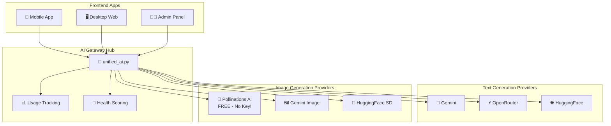
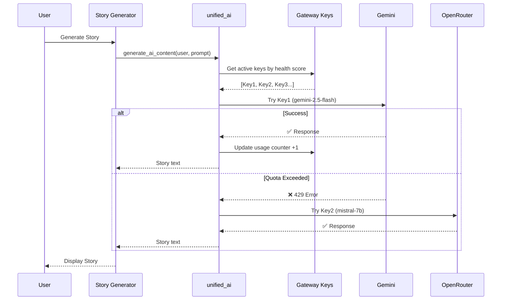
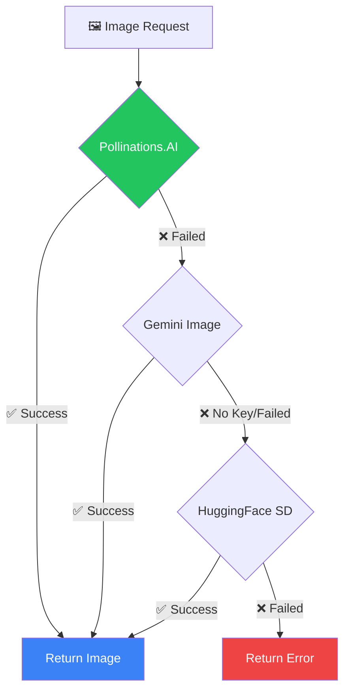

# AI Gateway - Centralized Architecture 🎯

## System Overview



---

## Text Generation Flow



---

## Image Generation Flow



> **Key Point:** Pollinations.AI is **FREE with no API key required!**

---

## Provider Adapters

### Text Generation Adapters (6)
| File | Provider | Free Tier |
|------|----------|-----------|
| `gemini.py` | Google Gemini | ✅ 500/day |
| `openrouter.py` | OpenRouter | ✅ Varies |
| `huggingface.py` | HuggingFace | ✅ 1000/day |
| `groq.py` | Groq | ✅ Fast |
| `cohere.py` | Cohere | ✅ Limited |
| `deepinfra.py` | DeepInfra | ✅ Limited |

### Image Generation Adapters (4)
| File | Provider | Free Tier |
|------|----------|-----------|
| `image_pollinations.py` | Pollinations.AI | ✅ **UNLIMITED!** |
| `image_gemini.py` | Google Gemini | 500/day |
| `image_huggingface.py` | Stable Diffusion | 1000/day |
| `image_openrouter.py` | OpenRouter | Varies |

---

## Generated Test Image


*A friendly cartoon owl reading a German language book - generated by Pollinations.AI*

---

## API Entry Points

| Feature | Endpoint | Uses Gateway? |
|---------|----------|---------------|
| Story Generator | `generate-advanced-text/` | ✅ Yes |
| Exam Generator | `generate-exam/` | ✅ Yes |
| Text Converter | `convert-text/` | ✅ Yes |
| Vocab Enrichment | `vocab/` | ✅ Yes |
| **Image Generation** | `generate_ai_image()` | ✅ Yes |

---

## Code Usage Example

### Text Generation
```python
from api.unified_ai import generate_ai_content

response = generate_ai_content(
    user=request.user,
    prompt="Write a German story about a cat",
    max_tokens=2048
)
print(response.text)
```

### Image Generation
```python
from api.unified_ai import generate_ai_image

result = generate_ai_image(
    user=request.user,
    prompt="A colorful owl reading a book",
    size="1024x1024",
    style="cartoon"
)

if result["success"]:
    image_base64 = result["image_base64"]
```

---

## Summary Architecture

```
┌──────────────────────────────────────────────────────────────┐
│                    YOUR APP REQUESTS                          │
│         Stories • Exams • Text • Vocabulary • Images         │
└──────────────────────────────────────────────────────────────┘
                              │
                              ▼
┌──────────────────────────────────────────────────────────────┐
│                     🎯 UNIFIED AI GATEWAY                     │
│                                                              │
│  ┌─────────────┐  ┌─────────────┐  ┌─────────────┐          │
│  │ Key Selector│  │Usage Tracker│  │Health Score │          │
│  └─────────────┘  └─────────────┘  └─────────────┘          │
│                                                              │
│  Automatic Fallback: Provider 1 → Provider 2 → Provider 3   │
└──────────────────────────────────────────────────────────────┘
                              │
        ┌─────────────────────┼─────────────────────┐
        ▼                     ▼                     ▼
   ┌─────────┐          ┌─────────┐          ┌─────────┐
   │ Gemini  │          │OpenRouter│         │Pollinations│
   │  FREE   │          │  FREE   │          │   FREE    │
   └─────────┘          └─────────┘          └─────────┘
```

---

*Document created: December 8, 2025*
