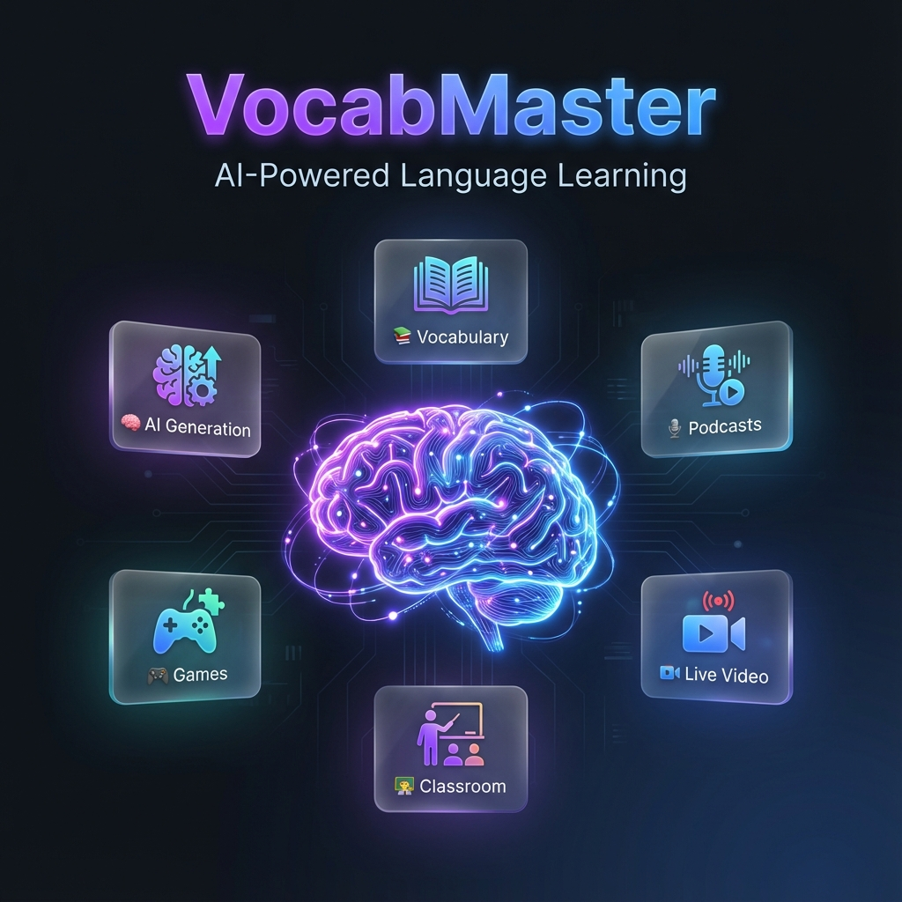
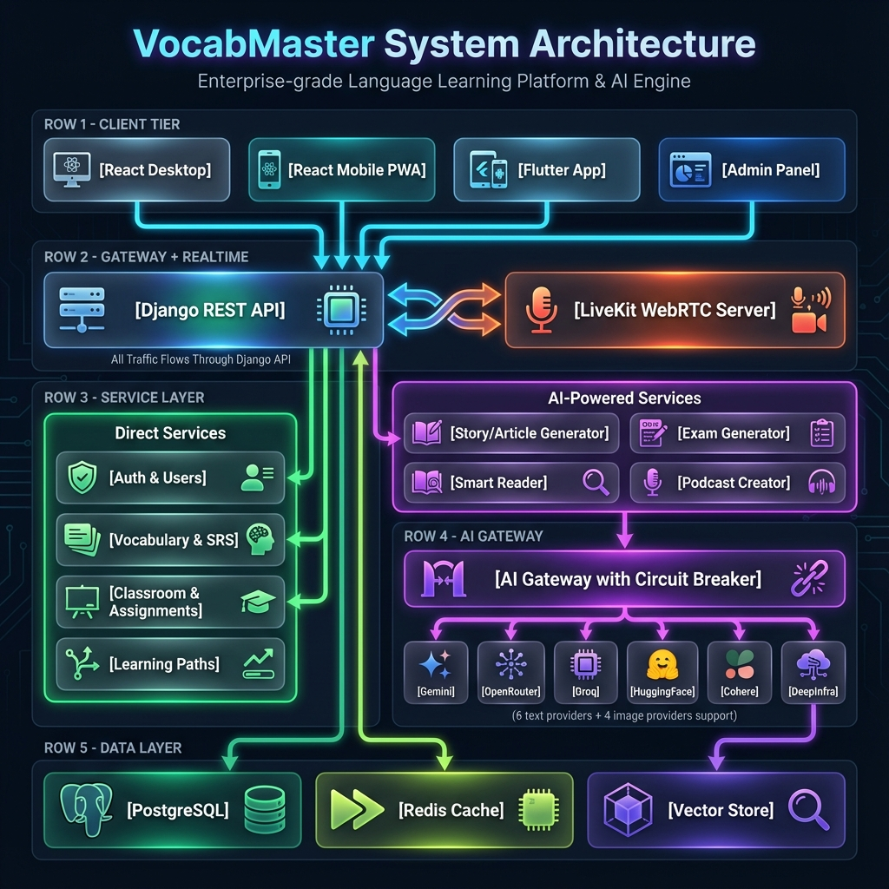

<p align="center">
  
</p>

<h1 align="center">🧠 VocabMaster</h1>

<p align="center">
  <strong>AI-Powered Language Learning Platform</strong><br>
  Learn any language with AI-generated content, spaced repetition, podcasts, live classes, and gamified practice.
</p>

<p align="center">
  
  
  
  
  
</p>

---

## ✨ Features

### 🧠 AI Content Generation
| Feature | Description |
|---------|-------------|
| **Stories** | AI-generated stories with images |
| **Articles** | Educational articles on any topic |
| **Dialogues** | Realistic conversation practice |
| **Grammar** | Auto-generated grammar exercises |

### 📚 Vocabulary & SRS
| Feature | Description |
|---------|-------------|
| **Spaced Repetition** | SM-2 algorithm for optimal review |
| **Flashcards** | Interactive learning cards |
| **Quiz Modes** | Multiple quiz types |
| **Semantic Search** | Find related words by meaning |

### 🎙️ Podcasts
| Feature | Description |
|---------|-------------|
| **AI Podcasts** | Generate learning podcasts |
| **External RSS** | Import your favorite shows |
| **Podcast Exams** | Learn from episodes |

### 👨‍🏫 Classroom & Live Sessions
| Feature | Description |
|---------|-------------|
| **Classrooms** | Teachers manage student groups |
| **Assignments** | Create and track assignments |
| **Live Video** | LiveKit-powered video classes |
| **Whiteboard** | Real-time collaboration |
| **Learning Paths** | Structured curriculum |

### 🎮 Games & Practice
| Feature | Description |
|---------|-------------|
| **Game Arena** | Multiplayer vocabulary games |
| **Time Challenges** | Speed practice |
| **Memory Match** | Memory-based learning |

### 📖 Smart Reader
| Feature | Description |
|---------|-------------|
| **URL Import** | Extract content from any URL |
| **YouTube** | Get transcripts from videos |
| **PDF/DOCX** | Parse documents |
| **OCR** | Extract text from images |

---

## 🏗️ Architecture

<p align="center">
  
</p>

### Tech Stack

| Layer | Technology |
|-------|------------|
| **Backend** | Django 4.x, Django REST Framework, LangGraph |
| **Desktop Frontend** | React 18, Vite, TailwindCSS |
| **Mobile** | React PWA + Flutter |
| **Admin Panel** | React 18 |
| **Database** | PostgreSQL, Redis |
| **Real-time** | LiveKit WebRTC |
| **AI Providers** | Gemini, OpenRouter, Groq, HuggingFace, Cohere, DeepInfra |
| **Image AI** | Pollinations (unlimited), Gemini |

### Data Flow

```
┌─────────────────────────────────────────────────────────────┐
│                      Client Apps                             │
│  [React Desktop] [React PWA] [Flutter] [Admin]              │
└──────────────────────┬──────────────────────────────────────┘
                       │
          ┌───────────┴───────────┐
          ▼                       ▼
   ┌──────────────┐       ┌──────────────┐
   │  Django API  │◄─────►│   LiveKit    │
   └──────┬───────┘       └──────────────┘
          │
    ┌─────┴─────┐
    ▼           ▼
┌────────┐  ┌────────────┐
│ Direct │  │ AI-Powered │
│Services│  │  Services  │
├────────┤  ├────────────┤
│• Auth  │  │• Story Gen │
│• Vocab │  │• Exam Gen  │
│• Class │  │• Reader    │
│• Paths │  │• Podcasts  │
└────┬───┘  └─────┬──────┘
     │            │
     │            ▼
     │     ┌──────────────┐
     │     │  AI Gateway  │
     │     │ with Fallback│
     │     └──────┬───────┘
     │            │
     │     ┌──────┴──────────────────────┐
     │     ▼      ▼       ▼       ▼      │
     │  [Gemini][OpenRouter][Groq][+7]   │
     │                                    │
     └───────────────┬────────────────────┘
                     ▼
         ┌──────────────────────┐
         │     Data Layer       │
         │ [PostgreSQL] [Redis] │
         └──────────────────────┘
```

---

## 📸 Screenshots

<!-- Add your screenshots here -->
| Dashboard | Mobile Home | Story Generator |
|-----------|-------------|-----------------|
|  |  |  |

| Podcast Player | Live Classroom |
|----------------|----------------|
|  |  |

---

## 🚀 Quick Start

### Prerequisites
- Python 3.10+
- Node.js 18+
- PostgreSQL (or SQLite for dev)
- Redis

### Backend
```bash
cd server
pip install -r requirements.txt
python manage.py migrate
python manage.py runserver
```

### Frontend
```bash
cd client
npm install
npm run dev
```

### Admin Panel
```bash
cd admin-client
npm install
npm run dev
```

---

## 📊 Project Stats

| Metric | Count |
|--------|-------|
| Backend Python Files | 159 |
| Desktop Pages | 32 |
| Desktop Components | 48 |
| Mobile React Pages | 81 |
| Flutter Dart Files | 73 |
| Admin Pages | 28 |
| **Total Files** | **470+** |

---

## 🗺️ Roadmap

- [ ] iOS Native App
- [ ] Offline Mode
- [ ] Voice Recognition
- [ ] AI Conversation Practice
- [ ] Community Features

---

## 📄 License

MIT License - see [LICENSE](LICENSE) for details.

---

<p align="center">
  Made with ❤️ for language learners
</p>
