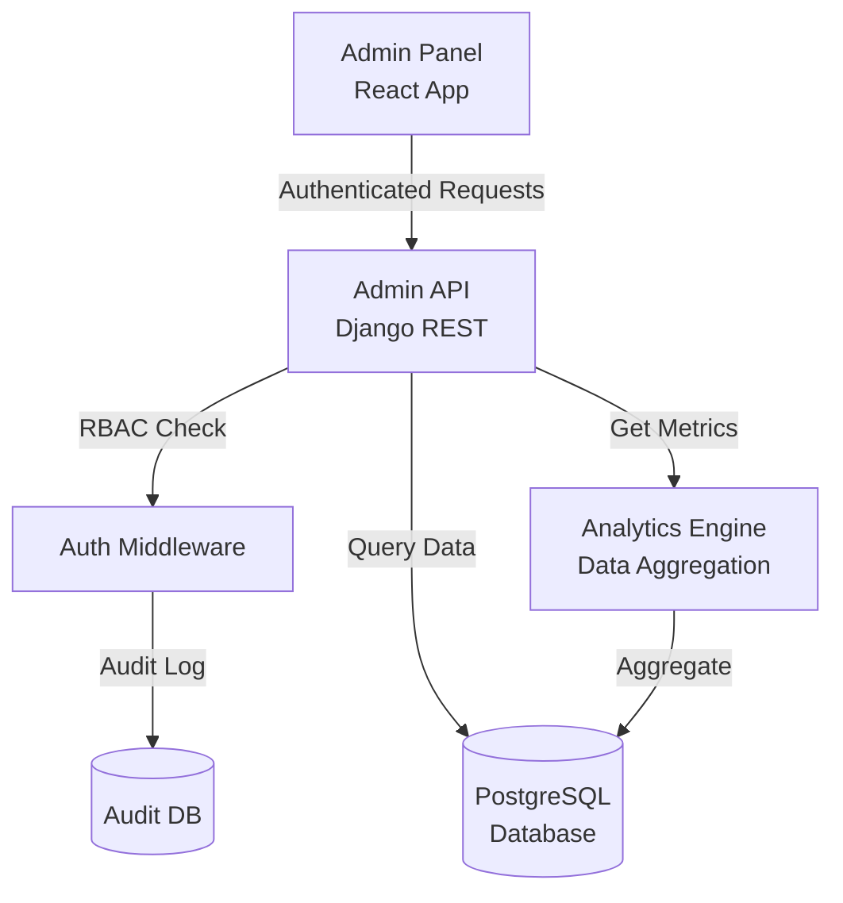
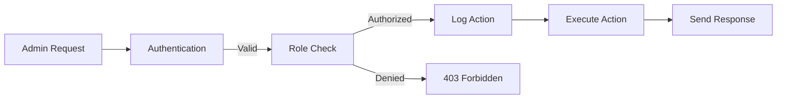

# VocabMaster Admin Panel - Master Plan & Requirements

**Version:** 1.0  
**Status:** Planning Phase  
**Estimated Effort:** 3-4 weeks development  
**Target:** Enterprise-grade admin panel with master BI solution

---

## 🎯 Executive Summary

This document outlines the complete plan for building a comprehensive admin panel for VocabMaster that will serve as a **master Business Intelligence (BI) solution** with full administrative capabilities. The admin panel will enable administrators to manage users, moderate content, analyze data, monitor systems, and configure the platform.

---

## 🏗️ Architecture Overview

### System Architecture



### Access Control Flow



---

## 👥 Admin User Roles & Privileges

### Role-Based Access Control (RBAC)

#### 1. **SUPER_ADMIN** (Full Access)
**Description:** Platform owner with unrestricted access to everything.

**Permissions:**
- ✅ All user management actions
- ✅ All content management actions
- ✅ All analytics and reports
- ✅ System configuration
- ✅ Database operations
- ✅ Create/delete admin accounts
- ✅ Assign/revoke roles
- ✅ Access audit logs
- ✅ Emergency actions (shutdown, rollback)

#### 2. **CONTENT_MODERATOR**
**Description:** Manages and moderates all user-generated content.

**Permissions:**
- ✅ View all vocabulary (public/private)
- ✅ Edit/delete vocabulary
- ✅ View all AI-generated content
- ✅ Edit/delete generated content (stories, articles, dialogues)
- ✅ Manage grammar topics
- ✅ Manage exams
- ✅ Flag inappropriate content
- ✅ View content analytics
- ❌ User account management
- ❌ System configuration
- ❌ Database operations

#### 3. **USER_SUPPORT**
**Description:** Handles user accounts and support requests.

**Permissions:**
- ✅ View all users
- ✅ View user details and activity
- ✅ Reset user passwords
- ✅ Suspend/unsuspend accounts
- ✅ Send notifications to users
- ✅ Export user data (GDPR requests)
- ✅ View user analytics
- ❌ Delete users permanently
- ❌ Edit content
- ❌ System configuration

#### 4. **ANALYST** (Read-Only)
**Description:** Data analyst with access to all reports and analytics.

**Permissions:**
- ✅ View all dashboards
- ✅ View all analytics
- ✅ Export reports (CSV, PDF)
- ✅ Create custom queries
- ✅ View aggregated user data
- ❌ Edit any data
- ❌ User management
- ❌ Content management
- ❌ System configuration

#### 5. **SYSTEM_ADMIN**
**Description:** Manages technical infrastructure and monitoring.

**Permissions:**
- ✅ View system health
- ✅ Monitor database performance
- ✅ View error logs
- ✅ Manage background tasks
- ✅ Configure system settings
- ✅ Manage API integrations
- ✅ Database backups/restores
- ❌ User/content management
- ✅ View system analytics only

---

## 📊 BI Dashboards & Analytics

### Dashboard 1: **Executive Overview** (Main Dashboard)

**Purpose:** High-level KPIs and trends visible at a glance.

**Metrics:**
- 📈 Total Users (with growth %)
- 📈 Active Users Today/Week/Month (DAU/WAU/MAU)
- 📈 New Signups (last 7/30 days)
- 📈 Total Vocabulary Words
- 📈 AI Content Generated (total + last 7 days)
- 📈 Practice Sessions Today
- 📈 System Health Status (color-coded)
- 📈 API Success Rate (%)

**Visualizations:**
- KPI cards (big numbers with icons)
- User growth line chart (last 30 days)
- Activity heatmap (last 7 days)
- Quick stats table

**Time Range:** Last 24h, 7d, 30d, 90d, All time

---

### Dashboard 2: **User Analytics**

**Purpose:** Deep dive into user behavior, growth, and retention.

**Metrics & Charts:**

1. **User Growth Analysis**
   - Line chart: New signups over time
   - Bar chart: Signups by month
   - Growth rate percentage

2. **User Demographics**
   - Pie chart: Learning language distribution
   - Pie chart: Native language distribution
   - Donut chart: CEFR level distribution
   - Bar chart: Geographic distribution (top 10 countries)

3. **User Engagement**
   - Line chart: Daily Active Users (DAU)
   - Line chart: Monthly Active Users (MAU)
   - Metric: DAU/MAU ratio (engagement score)
   - Histogram: Session duration distribution

4. **User Retention**
   - Cohort table: User retention by signup month
   - Churn rate over time
   - User lifecycle stages (new, active, at-risk, churned)

5. **User Activity Patterns**
   - Heatmap: Activity by day of week and hour
   - Bar chart: Most active users (top 20)
   - Table: User segmentation (power users, casual, inactive)

**Filters:**
- Date range
- Learning language
- CEFR level
- User status (active/inactive)
- Geographic region

---

### Dashboard 3: **Engagement & Activity**

**Purpose:** Understand how users interact with the platform.

**Metrics & Charts:**

1. **Practice  Sessions**
   - Line chart: Practice sessions over time
   - Bar chart: Sessions by quiz type
   - Metric: Average sessions per user
   - Distribution: Session length

2. **Vocabulary Management**
   - Line chart: Vocabulary added over time
   - Bar chart: Words added by language
   - Bar chart: Words by type (noun, verb, adjective)
   - Metric: Average vocabulary size per user

3. **Content Generation**
   - Stacked area chart: Content generated by type (story, article, dialogue)
   - Bar chart: Content by CEFR level
   - Line chart: Generation requests over time
   - Table: Most popular topics

4. **Feature Usage**
   - Bar chart: Feature usage comparison
   - Pie chart: Most used features
   - Time series: Feature adoption over time

5. **Grammar & Study**
   - Bar chart: Grammar topics viewed
   - Line chart: Podcast creations
   - Table: Most popular grammar categories

**Filters:**
- Date range
- Content type
- Language
- CEFR level

---

### Dashboard 4: **AI Usage & Costs**

**Purpose:** Monitor AI API usage, performance, and estimated costs.

**Metrics & Charts:**

1. **API Call Volume**
   - Stacked bar chart: API calls by provider (Gemini, Stable Horde, HF, OpenRouter)
   - Line chart: Total API calls over time
   - Table: Calls per endpoint

2. **Success & Failure Rates**
   - Line chart: Success rate over time by provider
   - Pie chart: Error distribution by type
   - Table: Top error messages

3. **Performance Metrics**
   - Histogram: Response time distribution
   - Line chart: Average response time by provider
   - Box plot: Response time comparison

4. **Cost Estimation**
   - Metric cards: Estimated cost per provider
   - Stacked bar: Cost breakdown by feature
   - Line chart: Cost trend over time
   - Table: Cost per user (heavy users)

5. **Image Generation**
   - Bar chart: Images by provider
   - Success/failure/retry rates
   - Average generation time
   - Queue wait times (Stable Horde)

**Filters:**
- Date range
- AI provider
- API endpoint
- User

---

### Dashboard 5: **Content Analytics**

**Purpose:** Analyze user-generated and AI-generated content quality and trends.

**Metrics & Charts:**

1. **Content Volume**
   - Pie chart: Content by type
   - Bar chart: Content by language
   - Line chart: Content creation over time
   - Metric: Total content pieces

2. **Content Quality**
   - Bar chart: Public vs private vocabulary ratio
   - Scatter plot: Content length vs view count
   - Table: Most viewed content
   - Metric: Average content quality score

3. **Content Moderation**
   - Metric: Flagged content count
   - Pie chart: Moderation status (approved, pending, rejected)
   - Table: Recent moderation actions

4. **Trending Topics**
   - Word cloud: Popular vocabulary topics
   - Bar chart: Top tags used
   - Table: Trending story themes

5. **Social Sharing**
   - Bar chart: Most shared vocabulary
   - Line chart: Share actions over time
   - Table: Top content creators

**Filters:**
- Content type
- Language
- CEFR level
- Visibility (public/private)
- Date range

---

### Dashboard 6: **System Health & Performance**

**Purpose:** Monitor technical infrastructure and system performance.

**Metrics & Charts:**

1. **System Status**
   - Status indicators: Database, API, Background tasks
   - Uptime percentage
   - Last deployment info

2. **Database Metrics**
   - Line chart: Database connections
   - Metric: Database size (GB)
   - Metric: Query performance (avg query time)
   - Table: Slow queries log

3. **API Performance**
   - Line chart: Response times
   - Bar chart: Requests per endpoint
   - Metric: Error rate (%)
   - Histogram: Response time distribution

4. **Error Monitoring**
   - Line chart: Errors over time
   - Pie chart: Errors by type
   - Table: Recent errors (last 100)
   - Bar chart: Errors by endpoint

5. **Background Tasks**
   - Metric: Active Celery workers
   - Metric: Pending tasks
   - Metric: Failed tasks
   - Table: Task queue status

**Alerts:**
- High error rate
- Slow response times
- Database connection issues
- Background task failures

---

## 🛠️ Admin Panel Features & Functionalities

### Section 1: **User Management**

#### 1.1 User List View

**Features:**
- Paginated table (20/50/100 per page)
- Search by username, email, name
- Filters:
  - Account status (active, suspended, banned)
  - Email verified (yes/no)
  - Learning language
  - CEFR level
  - Registration date range
  - Last activity date range
- Sort by: username, email, created_at, last_login
- Bulk actions:
  - Send notification
  - Export selected users (CSV)
  - Suspend multiple users

**Columns:**
- ID
- Username
- Email (with verified badge)
- Full Name
- Learning Language
- CEFR Level
- Created At
- Last Login
- Status (badge colored)
- Actions (dropdown)

#### 1.2 User Detail View

**Information Sections:**

**Profile Info:**
- Basic details (name, email, username)
- Profile picture
- Native language, learning language
- CEFR level, bio, location
- Account status, email verified
- Created at, last login

**Statistics:**
- Total vocabulary: XXX words
- Practice sessions: XXX
- AI content generated: XXX
- Followers: XXX, Following: XXX
- Streak: XX days

**Activity Timeline:**
- Recent actions (last 50)
- Practice sessions
- Vocabulary added
- Content generated
- Social interactions

**Vocabulary:**
- List of user's vocabulary (paginated)
- Export option

**Generated Content:**
- List of stories, articles, dialogues
- View/edit/delete options

**Progress Data:**
- SRS progress overview
- HLR statistics
- Performance charts

**Actions Available:**
- Edit profile
- Reset password
- Send notification (email or in-app)
- Suspend account (with reason)
- Ban account (permanent)
- Delete account (with confirmation, GDPR compliance)
- Export all user data (GDPR)
- Impersonate user (for support debugging)

---

### Section 2: **Content Moderation**

#### 2.1 Vocabulary Moderation

**Features:**
- View all vocabulary (public + private if needed)
- Filter by:
  - Visibility (public/private)
  - Language
  - Word type
  - Flagged status
  - User
- Search by word or translation
- Bulk actions:
  - Approve for public sharing
  - Remove from public
  - Delete multiple

**Actions per vocabulary:**
- View details
- Edit word/translation/examples
- Delete
- Flag as inappropriate
- View user who created it

#### 2.2 AI Content Moderation

**Features:**
- View all generated content (stories, articles, dialogues)
- Filter by:
  - Content type
  - Language
  - CEFR level
  - Favorited
  - Has images
  - Created date
- Search by title

**Actions per content:**
- View full content
- Edit title/content
- Delete
- Feature on homepage (admin pick)
- View generation metadata
- View creator

#### 2.3 Grammar Topics Management

**Features:**
- View all grammar topics
- Filter by language, level, category
- Create new topic manually
- Edit existing topics
- Delete topics
- Publish/unpublish

#### 2.4 Exam Management

**Features:**
- View all exams
- Filter by language, difficulty
- View exam attempts and scores
- Delete inappropriate exams
- Export exam data

---

### Section 3: **Analytics & Reports**

#### 3.1 Dashboard Access
- All 6 dashboards as described above
- Date range picker (global)
- Export capabilities

#### 3.2 Custom Reports

**Features:**
- Query builder (simple UI)
- Pre-built report templates:
  - Monthly user growth report
  - Content generation report
  - API usage report
  - User engagement report
- Schedule reports (daily/weekly/monthly email)
- Export formats: CSV, PDF, Excel

#### 3.3 Real-Time Metrics

**Features:**
- Live counter: Users online now
- Live counter: Active sessions
- Real-time API call monitor
- System status indicators

---

### Section 4: **System Monitoring**

#### 4.1 Health Dashboard
- System overview
- Database status
- API status
- Background tasks status
- Uptime monitoring

#### 4.2 Error Logs
- View recent errors (paginated)
- Filter by:
  - Error type
  - Date range
  - Endpoint
  - User (if applicable)
- Search error messages
- Export logs

#### 4.3 Background Tasks
- View Celery task queue
- Monitor task status
- Retry failed tasks
- Clear task queue

#### 4.4 Database Management
- View database size
- View table sizes
- Run migrations (with confirmation)
- **Automated Daily Backups:** Configured via cron job (uploads to secure storage)
- Create manual backup (download link)
- Restore from backup (upload)

---

### Section 5: **Configuration & Settings**

#### 5.1 System Settings

**Configurable Options:**
- Site name, description
- Default language
- Feature flags:
  - Enable/disable new user registration
  - Enable/disable AI features
  - Enable/disable social features
  - Maintenance mode
- Rate limits per endpoint
- API key validation settings

#### 5.2 AI Provider Configuration

**Manage Integrations:**
- Test API connections
- View usage statistics
- Configure fallback providers
- Set default models

#### 5.3 Email Configuration
- Test email sending
- View email templates
- Edit email content

#### 5.4 Admin User Management
- List all admin users
- Create new admin
- Assign roles
- Revoke admin access
- View admin activity logs

---

### Section 6: **Audit & Security**

#### 6.1 Admin Audit Logs

**Track All Admin Actions:**
- Who performed the action
- What action was performed
- When (timestamp)
- IP address
- Target (user, content, etc.)
- Result (success/failure)

**Filterable by:**
- Admin user
- Action type
- Date range
- Resource type

#### 6.2 Security Settings
- View failed login attempts
- IP whitelist for admin access
- Enable/disable 2FA for admins
- Session timeout settings
- CSRF token management

---

## 🗄️ Database Schema Additions

### New Models Required

#### 1. AdminRole
```python
class AdminRole(models.Model):
    ROLES = [
        ('SUPER_ADMIN', 'Super Admin'),
        ('CONTENT_MODERATOR', 'Content Moderator'),
        ('USER_SUPPORT', 'User Support'),
        ('ANALYST', 'Analyst'),
        ('SYSTEM_ADMIN', 'System Admin'),
    ]
    
    user = models.OneToOneField(User, on_delete=models.CASCADE, related_name='admin_role')
    role = models.CharField(max_length=50, choices=ROLES)
    assigned_by = models.ForeignKey(User, on_delete=models.SET_NULL, null=True, related_name='assigned_admins')
    assigned_at = models.DateTimeField(auto_now_add=True)
    is_active = models.BooleanField(default=True)
```

#### 2. AdminAuditLog
```python
class AdminAuditLog(models.Model):
    admin_user = models.ForeignKey(User, on_delete=models.SET_NULL, null=True)
    action = models.CharField(max_length=100)  # 'user_suspended', 'content_deleted', etc.
    resource_type = models.CharField(max_length=50)  # 'user', 'vocabulary', 'content', etc.
    resource_id = models.IntegerField(null=True)
    details = models.JSONField(default=dict)  # Additional context
    ip_address = models.GenericIPAddressField()
    timestamp = models.DateTimeField(auto_now_add=True)
    success = models.BooleanField(default=True)
    error_message = models.TextField(blank=True)
```

#### 3. SystemMetrics (for caching aggregated data)
```python
class SystemMetrics(models.Model):
    date = models.DateField(unique=True, db_index=True)
    total_users = models.IntegerField(default=0)
    active_users_day = models.IntegerField(default=0)
    new_signups = models.IntegerField(default=0)
    practice_sessions = models.IntegerField(default=0)
    vocabulary_added = models.IntegerField(default=0)
    content_generated = models.IntegerField(default=0)
    api_calls_total = models.IntegerField(default=0)
    api_calls_gemini = models.IntegerField(default=0)
    api_calls_stable_horde = models.IntegerField(default=0)
    api_calls_huggingface = models.IntegerField(default=0)
    api_calls_openrouter = models.IntegerField(default=0)
    errors_count = models.IntegerField(default=0)
    raw_data = models.JSONField(default=dict)  # For flexible metrics
```

#### 4. APIUsageLog
```python
class APIUsageLog(models.Model):
    user = models.ForeignKey(User, on_delete=models.SET_NULL, null=True)
    provider = models.CharField(max_length=50)  # 'gemini', 'stable_horde', etc.
    endpoint = models.CharField(max_length=200)
    request_data = models.JSONField(default=dict)
    response_status = models.IntegerField()  # HTTP status
    response_time_ms = models.IntegerField()  # Milliseconds
    success = models.BooleanField(default=True)
    error_message = models.TextField(blank=True)
    estimated_cost = models.DecimalField(max_digits=10, decimal_places=6, default=0)
    timestamp = models.DateTimeField(auto_now_add=True, db_index=True)
```

#### 5. UserActivityLog
```python
class UserActivityLog(models.Model):
    user = models.ForeignKey(User, on_delete=models.CASCADE)
    action = models.CharField(max_length=100)  # 'login', 'vocabulary_added', etc.
    details = models.JSONField(default=dict)
    ip_address = models.GenericIPAddressField(null=True)
    user_agent = models.TextField(blank=True)
    timestamp = models.DateTimeField(auto_now_add=True, db_index=True)
```

---

## 🔌 Backend API Endpoints

### Admin Authentication
- `POST /api/admin/auth/login/` - Admin login (separate from user login)
- `POST /api/admin/auth/logout/` - Admin logout
- `POST /api/admin/auth/verify-2fa/` - 2FA verification
- `GET /api/admin/auth/me/` - Get current admin user info

### User Management
- `GET /api/admin/users/` - List all users (paginated, filterable)
- `GET /api/admin/users/{id}/` - User details
- `PATCH /api/admin/users/{id}/` - Edit user
- `DELETE /api/admin/users/{id}/` - Delete user
- `POST /api/admin/users/{id}/suspend/` - Suspend user
- `POST /api/admin/users/{id}/unsuspend/` - Unsuspend user
- `POST /api/admin/users/{id}/reset-password/` - Force password reset
- `POST /api/admin/users/{id}/send-notification/` - Send notification
- `GET /api/admin/users/{id}/export/` - Export user data (GDPR)
- `GET /api/admin/users/{id}/activity/` - User activity log
- `POST /api/admin/users/{id}/impersonate/` - Impersonate user (get token)

### Content Moderation
- `GET /api/admin/vocabulary/` - List all vocabulary
- `PATCH /api/admin/vocabulary/{id}/` - Edit vocabulary
- `DELETE /api/admin/vocabulary/{id}/` - Delete vocabulary
- `GET /api/admin/content/` - List all generated content
- `PATCH /api/admin/content/{id}/` - Edit content
- `DELETE /api/admin/content/{id}/` - Delete content
- `POST /api/admin/content/{id}/feature/` - Feature content
- `GET /api/admin/grammar/` - List grammar topics
- `POST /api/admin/grammar/` - Create grammar topic
- `PATCH /api/admin/grammar/{id}/` - Edit grammar topic
- `DELETE /api/admin/grammar/{id}/` - Delete grammar topic

### Analytics
- `GET /api/admin/analytics/overview/` - Executive dashboard data
- `GET /api/admin/analytics/users/` - User analytics
- `GET /api/admin/analytics/engagement/` - Engagement metrics
- `GET /api/admin/analytics/ai-usage/` - AI API usage
- `GET /api/admin/analytics/content/` - Content analytics
- `GET /api/admin/analytics/system/` - System health metrics
- `POST /api/admin/analytics/custom-query/` - Run custom query
- `POST /api/admin/analytics/export/` - Export report

### System Monitoring
- `GET /api/admin/system/health/` - System health check
- `GET /api/admin/system/logs/` - Error logs
- `GET /api/admin/system/tasks/` - Background tasks status
- `POST /api/admin/system/tasks/{id}/retry/` - Retry failed task
- `GET /api/admin/system/database/` - Database metrics
- `POST /api/admin/system/backup/` - Create database backup
- `POST /api/admin/system/restore/` - Restore from backup

### Configuration
- `GET /api/admin/config/` - Get system settings
- `PATCH /api/admin/config/` - Update system settings
- `GET /api/admin/config/admins/` - List admin users
- `POST /api/admin/config/admins/` - Create admin user
- `PATCH /api/admin/config/admins/{id}/` - Update admin role
- `DELETE /api/admin/config/admins/{id}/` - Remove admin access

### Audit
- `GET /api/admin/audit/` - Admin audit logs (paginated, filterable)
- `GET /api/admin/security/failed-logins/` - Failed login attempts
- `GET /api/admin/security/ip-whitelist/` - IP whitelist

---

## 🎨 Frontend Implementation

### Technology Stack

**Core:**
- React 19 + Vite
- Tailwind CSS (consistent with main app)
- React Router for routing

**Charts & Visualizations:**
- **Selected Library:** **Apache ECharts** (Enterprise-grade BI)
- **Why:** Best for complex data visualization, high performance, and "Master BI" requirements.
- **Capabilities:** Heatmaps, Sankey diagrams, complex line/bar combinations, zoom/pan support.

**Data Tables:**
- TanStack Table (React Table v8) - powerful, flexible

**Real-Time Data:**
- **Technology:** WebSockets (Django Channels)
- **Usage:** Live user counts, real-time API monitoring, active task status
- date-fns - date manipulation
- axios - API calls
- react-hot-toast - notifications
- papaparse - CSV export
- jsPDF - PDF export
- react-to-print - print functionality

### UI Structure

```
admin/
├── src/
│   ├── pages/
│   │   ├── Dashboard.jsx (Executive Overview)
│   │   ├── UserManagement/
│   │   │   ├── UserList.jsx
│   │   │   └── UserDetail.jsx
│   │   ├── ContentModeration/
│   │   │   ├── VocabularyList.jsx
│   │   │   ├── GeneratedContentList.jsx
│   │   │   └── GrammarTopics.jsx
│   │   ├── Analytics/
│   │   │   ├── UserAnalytics.jsx
│   │   │   ├── EngagementAnalytics.jsx
│   │   │   ├── AIUsageAnalytics.jsx
│   │   │   ├── ContentAnalytics.jsx
│   │   │   └── SystemHealth.jsx
│   │   ├── System/
│   │   │   ├── Logs.jsx
│   │   │   ├── Tasks.jsx
│   │   │   └── Database.jsx
│   │   ├── Configuration/
│   │   │   ├── Settings.jsx
│   │   │   └── AdminUsers.jsx
│   │   └── Audit/
│   │       └── AuditLogs.jsx
│   ├── components/
│   │   ├── charts/
│   │   │   ├── LineChart.jsx
│   │   │   ├── BarChart.jsx
│   │   │   ├── PieChart.jsx
│   │   │   ├── Heatmap.jsx
│   │   │   └── KPICard.jsx
│   │   ├── tables/
│   │   │   └── DataTable.jsx
│   │   ├── layout/
│   │   │   ├── AdminNavbar.jsx
│   │   │   ├── AdminSidebar.jsx
│   │   │   └── AdminLayout.jsx
│   │   └── filters/
│   │       ├── DateRangePicker.jsx
│   │       └── FilterPanel.jsx
│   ├── context/
│   │   └── AdminAuthContext.jsx
│   └── api/
│       └── adminApi.js
```

### Navigation Structure

```
/admin/
├── /dashboard (Executive Overview)
├── /users (User Management)
│   └── /users/:id (User Detail)
├── /moderation
│   ├── /vocabulary
│   ├── /content
│   └── /grammar
├── /analytics
│   ├── /users
│   ├── /engagement
│   ├── /ai-usage
│   ├── /content
│   └── /system
├── /system
│   ├── /health
│   ├── /logs
│   ├── /tasks
│   └── /database
├── /configuration
│   ├── /settings
│   └── /admins
└── /audit
```

---

## 📋 Implementation Task Breakdown

### Phase 1: Foundation (Week 1)

**Backend Tasks:**
- [ ] Create admin models (AdminRole, AdminAuditLog, APIUsageLog, UserActivityLog, SystemMetrics)
- [ ] Create admin authentication system (separate from user auth)
- [ ] Implement RBAC middleware (check permissions)
- [ ] Create audit logging utility (decorator for tracking actions)
- [ ] Setup admin API routes structure

**Frontend Tasks:**
- [ ] Setup admin React app structure
- [ ] Create AdminLayout with sidebar and navbar
- [ ] Setup React Router with protected routes
- [ ] Create AdminAuthContext for authentication
- [ ] Setup admin API client (axios)

**Estimated Time:** 5 days

---

### Phase 2: User Management (Week 1-2)

**Backend Tasks:**
- [ ] Implement user list endpoint with filters and pagination
- [ ] Implement user detail endpoint
- [ ] Implement user edit/delete endpoints
- [ ] Implement suspend/unsuspend functionality
- [ ] Implement password reset functionality
- [ ] Implement user data export (GDPR)
- [ ] Implement user activity log endpoint
- [ ] Add audit logging to all user management actions

**Frontend Tasks:**
- [ ] Create UserList page with DataTable
- [ ] Add search, filters, sort functionality
- [ ] Create UserDetail page
- [ ] Add user edit modal
- [ ] Add suspend/delete confirmation modals
- [ ] Display user activity timeline
- [ ] Add export user data button

**Estimated Time:** 5-6 days

---

### Phase 3: Content Moderation (Week 2)

**Backend Tasks:**
- [ ] Implement vocabulary moderation endpoints
- [ ] Implement generated content moderation endpoints
- [ ] Implement grammar topic management endpoints
- [ ] Add bulk actions support
- [ ] Add content flagging system
- [ ] Add audit logging to content actions

**Frontend Tasks:**
- [ ] Create VocabularyList page
- [ ] Create GeneratedContentList page
- [ ] Create GrammarTopics page
- [ ] Add edit/delete functionality
- [ ] Add bulk action checkboxes
- [ ] Add content preview modals

**Estimated Time:** 4-5 days

---

### Phase 4: Basic Analytics (Week 2-3)

**Backend Tasks:**
- [ ] Create SystemMetrics aggregation service (daily cron job)
- [ ] Implement executive dashboard endpoint (overview stats)
- [ ] Implement user analytics endpoint
- [ ] Implement engagement analytics endpoint
- [ ] Create data aggregation utilities
- [ ] Add caching for analytics queries

**Frontend Tasks:**
- [ ] Setup Apache ECharts or Recharts
- [ ] Create Dashboard page with KPI cards
- [ ] Add user growth line chart
- [ ] Create UserAnalytics page
- [ ] Add demographic pie charts
- [ ] Add engagement line charts
- [ ] Create reusable chart components

**Estimated Time:** 6-7 days

---

### Phase 5: Advanced BI Dashboards (Week 3)

**Backend Tasks:**
- [ ] Implement AI usage analytics endpoint
- [ ] Implement content analytics endpoint
- [ ] Create API usage logging middleware
- [ ] Calculate estimated costs for AI calls
- [ ] Optimize analytics queries (indexing)

**Frontend Tasks:**
- [ ] Create AIUsageAnalytics page
- [ ] Add API calls stacked bar chart
- [ ] Add cost estimation metrics
- [ ] Create ContentAnalytics page
- [ ] Add content distribution charts
- [ ] Implement date range filtering (global)
- [ ] Add export functionality (CSV, PDF)

**Estimated Time:** 5-6 days

---

### Phase 6: System Monitoring (Week 4)

**Backend Tasks:**
- [ ] Implement system health check endpoint
- [ ] Implement error logs endpoint with pagination
- [ ] Implement background tasks monitoring
- [ ] Create database metrics endpoint
- [ ] Implement backup/restore functionality
- [ ] Add real-time metrics (WebSocket or polling)

**Frontend Tasks:**
- [ ] Create SystemHealth page
- [ ] Add status indicators
- [ ] Create Logs page with filtering
- [ ] Create Tasks page
- [ ] Create Database page
- [ ] Add real-time updates

**Estimated Time:** 4-5 days

---

### Phase 7: Configuration & Audit (Week 4)

**Backend Tasks:**
- [ ] Implement system settings CRUD
- [ ] Implement admin user management (create, edit, delete admins)
- [ ] Implement audit logs endpoint
- [ ] Implement security settings
- [ ] Add IP whitelist functionality
- [ ] Add 2FA support (optional)

**Frontend Tasks:**
- [ ] Create Settings page
- [ ] Create AdminUsers page
- [ ] Create AuditLogs page with filtering
- [ ] Add admin role assignment UI
- [ ] Add security settings UI

**Estimated Time:** 3-4 days

---

## 🔒 Security Considerations

### Authentication & Authorization
- ✅ Separate admin authentication (not same as user auth)
- ✅ **Optional** 2FA for admin accounts (Google Authenticator)
- ✅ Strong password requirements
- ✅ Session timeout (15 minutes idle, 2 hours max)
- ✅ IP whitelist for admin panel access
- ✅ RBAC on every endpoint (permission checks)

### Audit & Compliance
- ✅ Log every admin action (who, what, when, where)
- ✅ Immutable audit logs (cannot be deleted)
- ✅ GDPR compliance (user data export/delete)
- ✅ Regular security audits

### Data Protection
- ✅ HTTPS only (SSL/TLS)
- ✅ CSRF protection
- ✅ SQL injection prevention (ORM)
- ✅ XSS protection (sanitize inputs)
- ✅ Rate limiting on admin endpoints

---

## 📦 Deployment Considerations

### Infrastructure
- **Hosting:** Separate Subdomain (e.g., `admin.vocabmaster.com`)
- **Platform:** Vercel (Free Tier supports multiple projects/domains)
- **Setup:** Deploy as separate Vercel project pointing to admin subdirectory or repository

**Recommendation:** Separate subdomain for better security isolation and independent deployment cycles.

### Environment Variables
```env
ADMIN_SECRET_KEY=<separate-key>
ADMIN_IP_WHITELIST=1.2.3.4,5.6.7.8
ADMIN_2FA_ENABLED=True
ADMIN_SESSION_TIMEOUT=900  # 15 minutes
```

---

## 🎯 Success Metrics

The admin panel is successful if:
- ✅ All 5 admin roles can perform their designated functions
- ✅ All 6 dashboards display accurate, real-time data
- ✅ All admin actions are logged in audit trail
- ✅ Reports can be exported in CSV and PDF
- ✅ System monitoring detects issues proactively
- ✅ Page load times < 2 seconds for all dashboards
- ✅ Mobile responsive (tablets at minimum)

---

## 📊 Sample Dashboard Mockups

### Executive Dashboard Layout
```
┌────────────────────────────────────────────────────────┐
│  VOCABMASTER ADMIN                         [User Menu] │
├────────────────────────────────────────────────────────┤
│                                                         │
│  [Dashboard] Users Moderation Analytics System Config  │
│                                                         │
│  ┌──────────┐ ┌──────────┐ ┌──────────┐ ┌──────────┐ │
│  │📊 12,453 │ │🟢 1,234  │ │➕ 487    │ │📝 45,231 │ │
│  │Total     │ │Active    │ │New This  │ │Vocabulary│ │
│  │Users     │ │Today     │ │Week      │ │Words     │ │
│  └──────────┘ └──────────┘ └──────────┘ └──────────┘ │
│                                                         │
│  User Growth (Last 30 Days)                            │
│  ┌───────────────────────────────────────────────┐    │
│  │     ╱╲                                        │    │
│  │   ╱    ╲           ╱╲                         │    │
- [ ] Add suspend/delete confirmation modals
- [ ] Display user activity timeline
- [ ] Add export user data button

**Estimated Time:** 5-6 days

---

### Phase 3: Content Moderation (Week 2)

**Backend Tasks:**
- [ ] Implement vocabulary moderation endpoints
- [ ] Implement generated content moderation endpoints
- [ ] Implement grammar topic management endpoints
- [ ] Add bulk actions support
- [ ] Add content flagging system
- [ ] Add audit logging to content actions

**Frontend Tasks:**
- [ ] Create VocabularyList page
- [ ] Create GeneratedContentList page
- [ ] Create GrammarTopics page
- [ ] Add edit/delete functionality
- [ ] Add bulk action checkboxes
- [ ] Add content preview modals

**Estimated Time:** 4-5 days

---

### Phase 4: Basic Analytics (Week 2-3)

**Backend Tasks:**
- [ ] Create SystemMetrics aggregation service (daily cron job)
- [ ] Implement executive dashboard endpoint (overview stats)
- [ ] Implement user analytics endpoint
- [ ] Implement engagement analytics endpoint
- [ ] Create data aggregation utilities
- [ ] Add caching for analytics queries

**Frontend Tasks:**
- [ ] Setup Apache ECharts or Recharts
- [ ] Create Dashboard page with KPI cards
- [ ] Add user growth line chart
- [ ] Create UserAnalytics page
- [ ] Add demographic pie charts
- [ ] Add engagement line charts
- [ ] Create reusable chart components

**Estimated Time:** 6-7 days

---

### Phase 5: Advanced BI Dashboards (Week 3)

**Backend Tasks:**
- [ ] Implement AI usage analytics endpoint
- [ ] Implement content analytics endpoint
- [ ] Create API usage logging middleware
- [ ] Calculate estimated costs for AI calls
- [ ] Optimize analytics queries (indexing)

**Frontend Tasks:**
- [ ] Create AIUsageAnalytics page
- [ ] Add API calls stacked bar chart
- [ ] Add cost estimation metrics
- [ ] Create ContentAnalytics page
- [ ] Add content distribution charts
- [ ] Implement date range filtering (global)
- [ ] Add export functionality (CSV, PDF)

**Estimated Time:** 5-6 days

---

### Phase 6: System Monitoring (Week 4)

**Backend Tasks:**
- [ ] Implement system health check endpoint
- [ ] Implement error logs endpoint with pagination
- [ ] Implement background tasks monitoring
- [ ] Create database metrics endpoint
- [ ] Implement backup/restore functionality
- [ ] Add real-time metrics (WebSocket or polling)

**Frontend Tasks:**
- [ ] Create SystemHealth page
- [ ] Add status indicators
- [ ] Create Logs page with filtering
- [ ] Create Tasks page
- [ ] Create Database page
- [ ] Add real-time updates

**Estimated Time:** 4-5 days

---

### Phase 7: Configuration & Audit (Week 4)

**Backend Tasks:**
- [ ] Implement system settings CRUD
- [ ] Implement admin user management (create, edit, delete admins)
- [ ] Implement audit logs endpoint
- [ ] Implement security settings
- [ ] Add IP whitelist functionality
- [ ] Add 2FA support (optional)

**Frontend Tasks:**
- [ ] Create Settings page
- [ ] Create AdminUsers page
- [ ] Create AuditLogs page with filtering
- [ ] Add admin role assignment UI
- [ ] Add security settings UI

**Estimated Time:** 3-4 days

---

## 🔒 Security Considerations

### Authentication & Authorization
- ✅ Separate admin authentication (not same as user auth)
- ✅ **Required** 2FA for admin accounts (Google Authenticator)
- ✅ Strong password requirements
- ✅ Session timeout (15 minutes idle, 2 hours max)
- ✅ IP whitelist for admin panel access
- ✅ RBAC on every endpoint (permission checks)

### Audit & Compliance
- ✅ Log every admin action (who, what, when, where)
- ✅ Immutable audit logs (cannot be deleted)
- ✅ GDPR compliance (user data export/delete)
- ✅ Regular security audits

### Data Protection
- ✅ HTTPS only (SSL/TLS)
- ✅ CSRF protection
- ✅ SQL injection prevention (ORM)
- ✅ XSS protection (sanitize inputs)
- ✅ Rate limiting on admin endpoints

---

## 📦 Deployment Considerations

### Infrastructure
- **Hosting:** Separate Subdomain (e.g., `admin.vocabmaster.com`)
- **Platform:** Vercel (Free Tier supports multiple projects/domains)
- **Setup:** Deploy as separate Vercel project pointing to admin subdirectory or repository

**Recommendation:** Separate subdomain for better security isolation and independent deployment cycles.

### Environment Variables
```env
ADMIN_SECRET_KEY=<separate-key>
ADMIN_IP_WHITELIST=1.2.3.4,5.6.7.8
ADMIN_2FA_ENABLED=True
ADMIN_SESSION_TIMEOUT=900  # 15 minutes
```

---

## 🎯 Success Metrics

The admin panel is successful if:
- ✅ All 5 admin roles can perform their designated functions
- ✅ All 6 dashboards display accurate, real-time data via WebSockets
- ✅ All admin actions are logged in audit trail
- ✅ Reports can be exported in CSV and PDF
- ✅ System monitoring detects issues proactively
- ✅ Page load times < 2 seconds for all dashboards
- ✅ Full Mobile Support: Responsive design for all dashboards and management tables

---

## 📊 Sample Dashboard Mockups

### Executive Dashboard Layout
```
┌────────────────────────────────────────────────────────┐
│  VOCABMASTER ADMIN                         [User Menu] │
├────────────────────────────────────────────────────────┤
│                                                         │
│  [Dashboard] Users Moderation Analytics System Config  │
│                                                         │
│  ┌──────────┐ ┌──────────┐ ┌──────────┐ ┌──────────┐ │
│  │📊 12,453 │ │🟢 1,234  │ │➕ 487    │ │📝 45,231 │ │
│  │Total     │ │Active    │ │New This  │ │Vocabulary│ │
│  │Users     │ │Today     │ │Week      │ │Words     │ │
│  └──────────┘ └──────────┘ └──────────┘ └──────────┘ │
│                                                         │
│  User Growth (Last 30 Days)                            │
│  ┌───────────────────────────────────────────────┐    │
│  │     ╱╲                                        │    │
│  │   ╱    ╲           ╱╲                         │    │
│  │ ╱        ╲       ╱    ╲                       │    │
│  └───────────────────────────────────────────────┘    │
│                                                         │
│  ┌─────────────────────┐  ┌─────────────────────┐    │
│  │ Top 5 Active Users  │  │ System Health       │    │
│  │ 1. user123 (234)    │  │ 🟢 API: Healthy     │    │
│  │ 2. learner456 (198) │  │ 🟢 DB: Healthy      │    │
│  │ 3. vocab_pro (187)  │  │ 🟢 Tasks: Running    │    │
│  └─────────────────────┘  └─────────────────────┘    │
└────────────────────────────────────────────────────────┘
```

---

## 🚀 Next Steps

1. **Set up development environment** for admin panel
2. **Initialize Admin React App** (Vite + Tailwind + ECharts)
3. **Begin Phase 1** (Foundation - Backend Auth & Models)
4. **Iterate and refine** based on feedback

---

**Document Version:** 1.1 (Finalized Plan)
**Last Updated:** November 27, 2025
**Author:** Assad Allah Alebrahim
**Status:** Approved for Implementation
