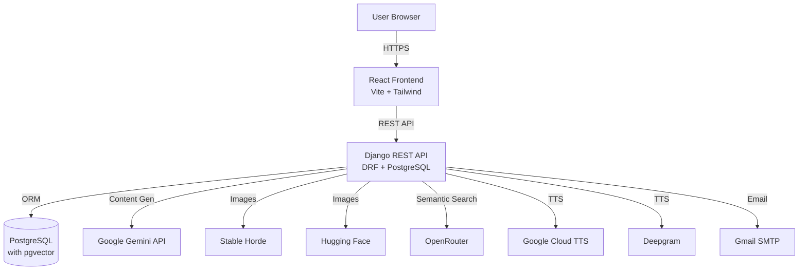

# VocabMaster - Technical Architecture

## System Architecture

### High-Level Architecture



### Backend Architecture

#### Django Project Structure

```
server/
├── vocab_server/          # Django project settings
│   ├── settings.py       # Main configuration
│   ├── urls.py           # Root URL routing
│   └── wsgi.py           # WSGI application
│
└── api/                   # Main API application
    ├── models.py         # 11 core data models
    ├── views.py          # 48+ API view functions
    ├── serializers.py    # DRF serializers
    ├── urls.py           # API routing (152 lines)
    │
    ├── AI Agents:
    │   ├── advanced_text_agent.py      # Story/Article/Dialogue generator
    │   ├── grammar_agent.py            # Grammar lesson generator
    │   ├── image_generation_agent.py   # Multi-provider image gen
    │   ├── agent_exam.py               # Exam creation agent
    │   └── embedding_service.py        # Vector embeddings
    │
    ├── Feature Modules:
    │   ├── ai_views.py                 # AI assistant endpoints
    │   ├── advanced_text_views.py      # Content generation
    │   ├── feature_views.py            # Grammar, podcasts, texts
    │   ├── tts_views.py                # Text-to-speech
    │   ├── semantic_search_views.py    # Vector search
    │   ├── google_auth.py              # OAuth + OTP
    │   └── password_views.py           # Password management
    │
    ├── Algorithms:
    │   ├── srs.py                      # SuperMemo 2 algorithm
    │   └── hlr.py                      # Half-Life Regression
    │
    └── Utilities:
        ├── prompts.py                  # AI prompt templates
        ├── character_consistency_enforcer.py
        └── image_quality_validator.py
```

#### Database Schema (PostgreSQL)

**Core Models (11 total):**

1. **User** (Django built-in)
   - Standard authentication fields

2. **UserProfile** (1:1 with User)
   - Fields: native_language, learning_language, level, bio, avatar, location
   - API keys: gemini_api_key, openrouter_api_key, stable_horde_key, etc.
   - Preferences: is_public, disable_ai_enrichment

3. **Tag**
   - Fields: name, user (Foreign Key)
   - Used for organizing vocabulary

4. **Vocabulary**
   - Fields: word, translation, type, level, article, plural, example
   - Synonyms, antonyms, tags (JSONField)
   - AI enrichment: ai_enriched, ai_data (JSONField)
   - Stats: correct_count, wrong_count, total_practice_count
   - Visibility: is_public

5. **UserProgress** (SRS tracking)
   - Fields: user, vocab, repetition_stage, mistakes
   - SuperMemo: easiness_factor, interval, next_review_date
   - HLR: hlr_difficulty, hlr_last_recall, hlr_success_count

6. **Quiz**
   - Fields: user, vocab, score, timestamp
   - Simple quiz result tracking

7. **SavedText**
   - Fields: title, content, language, created_at
   - Embedding: embedding (JSONField) for semantic search

8. **GeneratedContent** (Stories, Articles, Dialogues)
   - Fields: content_type, title, content (JSONField)
   - Generation params: target_language, cefr_level, word_count
   - Images: has_images, image_generation_status
   - Metadata: is_favorite, view_count

9. **GrammarTopic**
   - Fields: title, content (Markdown), level, category
   - Tags: tags (JSONField)
   - Metadata: generated_by_ai, generation_metadata

10. **Exam**
    - Fields: title, content (JSONField), language, difficulty
    - Stats: best_score, attempt_count

11. **ExamAttempt**
    - Fields: exam, user_answers (JSONField), feedback (JSONField), score

**Relationships:**
- User → UserProfile (1:1)
- User → Vocabulary (1:Many)
- User → UserProgress (1:Many)
- Vocabulary ← Progress (Many:1)
- User ↔ User (Many:Many via UserRelationship for following)

### Frontend Architecture

#### React Application Structure

```
client/src/
├── main.jsx              # App entry point
├── App.jsx               # Root component with routing
├── api.js                # Axios API client
│
├── context/              # React Context
│   ├── AuthContext.jsx  # Authentication state
│   └── ThemeContext.jsx # Theme management
│
├── pages/ (26 pages)
│   ├── Login.jsx
│   ├── Dashboard.jsx
│   ├── VocabList.jsx
│   ├── AddWord.jsx
│   ├── QuizSelector.jsx
│   ├── QuizPlay.jsx
│   ├── StatsDashboard.jsx
│   ├── AdvancedTextGenerator.jsx
│   ├── GeneratedContentLibrary.jsx
│   ├── StoryViewer.jsx
│   ├── ArticleViewer.jsx
│   ├── DialogueViewer.jsx
│   ├── GrammarGenerator.jsx
│   ├── GrammarLibrary.jsx
│   ├── GrammarPage.jsx
│   ├── PodcastCreator.jsx
│   ├── MyPodcasts.jsx
│   ├── TextGenerator.jsx
│   ├── TextReader.jsx
│   ├── ExamPage.jsx
│   ├── Settings.jsx
│   ├── Profile.jsx
│   ├── PublicProfile.jsx
│   ├── SharedBank.jsx
│   ├── MiniGames.jsx
│   └── games/
│
└── components/ (16 components)
    ├── Navbar.jsx
    ├── Sidebar.jsx
    ├── Logo.jsx
    ├── AIAssistant.jsx
    ├── AISetupModal.jsx
    ├── ActivityHeatmap.jsx
    ├── VocabularyMastery.jsx
    ├── HLRStatsCard.jsx
    ├── GrammarViewer.jsx
    ├── ReaderPractice.jsx
    ├── ExamQuestions.jsx
    ├── FloatingExamTimer.jsx
    ├── TagManager.jsx
    ├── ErrorBoundary.jsx
    └── GoogleAuthButton.jsx
```

#### State Management

- **AuthContext:** User authentication, token management
- **LocalStorage:** API keys, user preferences
- **Component State:** React hooks (useState, useEffect)
- **No Redux:** Kept simple with Context API

#### Routing Structure

```
/ → Dashboard (protected)
/login → Login/Signup
/vocab → Vocabulary List
/vocab/add → Add Word
/quiz → Quiz Selector
/quiz/play → Quiz Play
/stats → Statistics Dashboard
/generate → Advanced Text Generator
/library → Generated Content Library
/story/:id → Story Viewer
/article/:id → Article Viewer
/dialogue/:id → Dialogue Viewer
/grammar → Grammar Library
/grammar/generate → Grammar Generator
/grammar/:id → Grammar Topic Viewer
/podcast/create → Podcast Creator
/podcasts → My Podcasts
/exams → Exam Page
/settings → Settings
/profile → My Profile
/profile/:username → Public Profile
/shared → Shared Vocabulary Bank
/games → Mini Games
```

## API Architecture

### Authentication

**Method:** Token-based authentication
- Header: `Authorization: Token <token>`
- Public endpoints: `/auth/signup/`, `/auth/signin/`, `/auth/google/`
- All other endpoints require authentication

**OAuth:** Google OAuth 2.0 integration

### API Endpoint Categories

1. **Authentication** (7 endpoints)
   - Signup, signin, email verification
   - Google OAuth login
   - Password management
   - OTP verification

2. **Vocabulary** (10+ endpoints)
   - CRUD operations
   - CSV import/export
   - Semantic search
   - Public vocabulary browsing

3. **Practice & SRS** (6 endpoints)
   - Get words for practice (HLR prioritized)
   - Record practice results
   - Update progress (SuperMemo 2)
   - Review statistics

4. **AI Content Generation** (8 endpoints)
   - Generate stories/articles/dialogues
   - List generated content
   - Toggle favorites
   - Image generation status/retry

5. **Grammar** (REST + custom)
   - Grammar topics CRUD
   - AI generation

6. **TTS** (6 endpoints)
   - List voices
   - Generate speech
   - Validate API keys (Google, Deepgram, Speechify)

7. **Exams** (REST endpoints)
   - Create/manage exams
   - Submit attempts
   - View results

8. **Social** (4 endpoints)
   - User search
   - Follow/unfollow
   - Public profiles
   - Share notifications

## Deployment Architecture

### Production Stack

**Backend (Render):**
```yaml
Service: Web Service
Runtime: Python 3.11
Build: ./build.sh
Start: gunicorn vocab_server.wsgi:application
Health: /api/health/
Region: Frankfurt
```

**Database (Render):**
```yaml
Type: PostgreSQL
Plan: Free Tier
Region: Frankfurt
Extensions: pgvector
```

**Frontend (Vercel):**
```yaml
Framework: Vite
Build: npm run build
Output: dist/
Region: Auto (CDN)
```

### CI/CD Pipeline (GitHub Actions)

**Workflows:**
1. `deploy-backend.yml` - Auto-deploy backend to Render on push to main
2. `deploy-frontend.yml` - Deploy frontend to Vercel
3. `database-backup.yml` - Scheduled database backups

## Security Architecture

### Authentication
- Token-based authentication
- Password hashing (Django default)
- Google OAuth 2.0
- OTP email verification

### API Security
- CORS configured for frontend domain
- Rate limiting (django-ratelimit)
- HTTPS only in production
- Environment variable protection

### Data Privacy
- User data isolation
- Optional public profiles
- API keys stored per user
- No server-side key storage

## Performance Considerations

### Backend Optimizations
- Database indexing on `next_review_date`
- Query optimization with `select_related`
- Pagination (20 items per page)

### Frontend Optimizations
- Code splitting (Vite)
- Lazy loading
- Tailwind CSS purging
- Asset optimization

### Caching Strategy
- Static assets (Vercel CDN)
- API response caching (minimal, real-time data)

## Scalability Considerations

**Current Limits:**
- Free tier database (1GB storage)
- 512MB RAM on backend
- No background workers (Celery configured but not deployed)

**Scalability Path:**
- Upgrade to paid Render plan
- Enable Celery workers for async tasks
- Add Redis for caching
- Implement CDN for media
