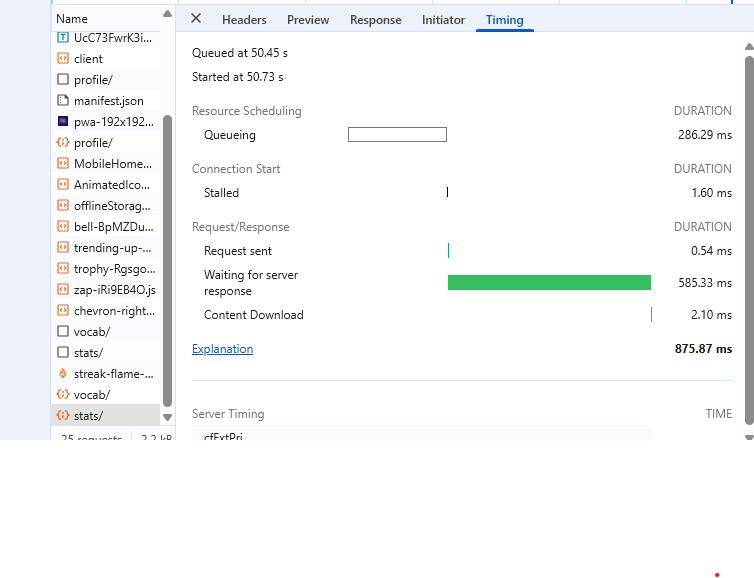

# Linking Flutter to Render Backend

> This guide explains how to replicate `client/src/api.js` in Flutter using **Dio**.

## 1. Setup Environment Variables
1.  Add `flutter_dotenv` to `pubspec.yaml`.
2.  Create a file `assets/.env` in your Flutter project root.
3.  Add your Render URL:
    ```env
    # For Emulator use http://10.0.2.2:8000
    # For Real Device/Production use your Render URL
    API_URL=https://your-app-name.onrender.com
    ```
4.  Add `assets/` to your `pubspec.yaml` assets section.

## 2. Create the API Client (`lib/core/network/api_client.dart`)

Does the job of `axios`:

```dart
import 'package:dio/dio.dart';
import 'package:flutter_dotenv/flutter_dotenv.dart';
import 'package:flutter_secure_storage/flutter_secure_storage.dart';

class ApiClient {
  static final ApiClient _instance = ApiClient._internal();
  late Dio dio;
  final _storage = const FlutterSecureStorage();

  factory ApiClient() {
    return _instance;
  }
    dio = Dio(BaseOptions(
      baseUrl: '${dotenv.env['API_URL']}/api/', // Appends /api/ like your js
      connectTimeout: const Duration(seconds: 10),
      receiveTimeout: const Duration(seconds: 10),
      headers: {
        'Content-Type': 'application/json',
        'Accept': 'application/json',
      },
    ));

    // Add Interceptors (Replicates api.interceptors.request.use)
    dio.interceptors.add(InterceptorsWrapper(
      onRequest: (options, handler) async {
        // 1. Get Token from Secure Storage (replaces localStorage)
        final token = await _storage.read(key: 'auth_token');
        
        // 2. Add Authorization Header
        if (token != null) {
          options.headers['Authorization'] = 'Token $token';
        }
        
        // Note: CSRF is usually not needed for Mobile Token Auth
        // But if you need it, you'd extract it from response cookies here.
        
        return handler.next(options);
      },
      onError: (DioException e, handler) {
        // Handle 401 Unauthorized (Logout user)
        if (e.response?.statusCode == 401) {
           // trigger logout
        }
        return handler.next(e);
      },
    ));
  }
}
```

## 3. Usage in Riverpod
Create a provider to use it anywhere:

```dart
// lib/core/providers/api_provider.dart
import 'package:flutter_riverpod/flutter_riverpod.dart';
import '../network/api_client.dart';

final apiProvider = Provider<Dio>((ref) {
  return ApiClient().dio;
});
```

## 4. Key Differences from React
| Feature | React (`api.js`) | Flutter (`Dio`) |
| :--- | :--- | :--- |
| **Storage** | `localStorage` | `FlutterSecureStorage` (Encrypted) |
| **Cookies** | Automatic (Browser) | Manual (CookieJar) - *Avoid if possible* |
| **Base URL** | `VITE_API_URL` | `dotenv` file |
| **CSRF** | `document.cookie` | Typically skipped for Mobile + Token Auth |
